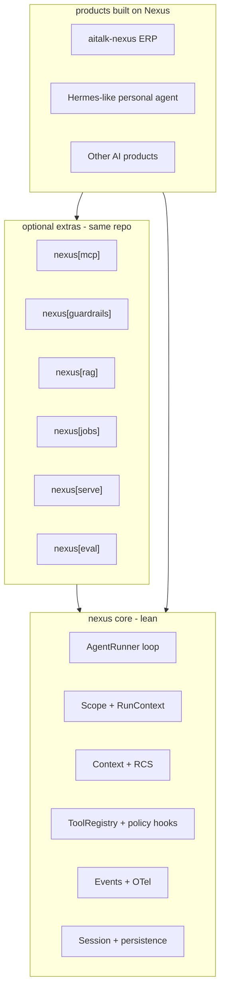

# Nexus as a general-purpose, SaaS-first agent framework

## Thesis

The 2026 market has settled: LangGraph owns durable stateful graphs, Pydantic AI owns typed single agents, Mastra owns the all-in-one TypeScript story, vendor SDKs own their ecosystems. None of them is **multi-tenant first**. Every SaaS team re-implements tenant scoping, per-tenant keys, per-plan toolsets, and scoped memory on top of a single-user framework.

**Position Nexus as: the agent framework where tenancy, scope, governance, and cost are primitives — plus native voice.** Everything else on this roadmap is table stakes we must close so nobody rejects Nexus for a missing checkbox.

Differentiators to protect and deepen: `RunContext` scoping ([nexus/tools/context.py](nexus-enterprise-agent/nexus/tools/context.py)), RCS context compression ([nexus/rcs](nexus-enterprise-agent/nexus/rcs)), scoped memory/skills, realtime voice ([nexus/realtime](nexus-enterprise-agent/nexus/realtime)), no global singletons.

## Design invariants (apply to every item below)

- Core `nexus` stays lean; new capability = new optional extra in the same repo (`nexus[mcp]`, `nexus[rag]`, `nexus[serve]`, `nexus[eval]`, `nexus[jobs]`, `nexus[guardrails]`).
- No global state. Every new subsystem takes `RunContext` (or an explicit config object) — never module-level singletons.
- Everything scope-aware: global / tenant / company / user, using one shared scope primitive (Milestone 1).
- Protocol + one reference implementation, not a plugin zoo. Third parties implement the protocol.
- Do not build a graph/workflow DSL. Nexus stays a turn loop plus multi-agent patterns; durability is added to the existing loop, not a new engine.
- Per [AGENTS.md](nexus-enterprise-agent/AGENTS.md): docs updated in the same change; no feature lands without its `docs/reference/*.md` page.

---

## Milestone 0 — Truth in config (v0.3.x patch, do first)

Several knobs are documented and typed but never enforced. This is the cheapest credibility win and unblocks later work.

- Enforce `TurnConfig.turn_timeout_seconds` and `max_tool_calls_per_turn` in the loop: [nexus/runner/agent_runner.py](nexus-enterprise-agent/nexus/runner/agent_runner.py).
- Enforce `@tool(timeout_seconds=...)` with `asyncio.wait_for` in `ToolRegistry.execute()`: [nexus/tools/registry.py](nexus-enterprise-agent/nexus/tools/registry.py), declared in [nexus/tools/decorators.py](nexus-enterprise-agent/nexus/tools/decorators.py).
- Wire `LLMProviderConfig.max_retries` / `timeout` into [nexus/llm/adapters/litellm.py](nexus-enterprise-agent/nexus/llm/adapters/litellm.py) using existing [nexus/utils/retry.py](nexus-enterprise-agent/nexus/utils/retry.py).
- Emit the reserved `human_in_loop.*` events instead of leaving them documented-but-silent: [nexus/events/models.py](nexus-enterprise-agent/nexus/events/models.py), [docs/reference/events.md](nexus-enterprise-agent/docs/reference/events.md).
- Either implement `swarm` or remove it from the schema and resolve-time fallback: [nexus/orchestration/resolver.py](nexus-enterprise-agent/nexus/orchestration/resolver.py). Decision: remove it; supervisor covers the use case.

## Milestone 1 — Scope primitive + typed results (v0.4, the "any project" release)

**1a. One scope model, used everywhere.** Today scoping logic is re-derived per subsystem (memory keys in [nexus/memory](nexus-enterprise-agent/nexus/memory), skill scope in [nexus/skills](nexus-enterprise-agent/nexus/skills), storage paths in [nexus/storage/paths.py](nexus-enterprise-agent/nexus/storage/paths.py)). Introduce `nexus/scope.py` with a `Scope` enum (`global | tenant | company | user`) and `scope_key(ctx, level, namespace)`, then migrate memory, skills, storage paths, and later RAG/guardrails/quotas onto it. This is the feature we market: any resource can be declared at global, company, or user level with one consistent rule.

**1b. Structured output.** `AgentConfig.result_type` and `AgentRunResult.structured_result` exist but are never populated ([nexus/config/agent.py](nexus-enterprise-agent/nexus/config/agent.py), [nexus/runner/result.py](nexus-enterprise-agent/nexus/runner/result.py)). Implement: JSON-schema request to the provider, Pydantic validation, bounded validation-retry with the error fed back, `stop_on_result_type` honored. This is Pydantic AI's headline feature and the single most common rejection reason for a Python framework.

**1c. Error taxonomy.** `nexus/errors.py`: `LLMError` (rate limit, auth, context length, provider), `ToolError`, `TimeoutError`, `GuardrailError`, each mapped from LiteLLM exceptions so retries, failover, and product error pages can branch on type.

**1d. Hook surface.** Only `on_turn_end` exists ([nexus/runner/hooks.py](nexus-enterprise-agent/nexus/runner/hooks.py)). Add `on_turn_start`, `before_tool_call`, `after_tool_call`, `before_llm_call` — all sync/async, all receiving `RunContext`. Guardrails, quotas, audit, and caching all ride these hooks instead of patching the runner repeatedly.

**1e. Parallel tool execution.** Opt-in `AgentConfig.parallel_tool_calls`, `asyncio.gather` over independent calls in the same LLM response, sequential remains the default for side-effecting tools.

## Milestone 2 — Interoperability: MCP (v0.5)

- `nexus[mcp]`: MCP client that mounts remote servers as namespaced tools in `ToolRegistry`, with per-tenant credentials pulled from `RunContext.auth` / services rather than a global config file. Server config in the manifest alongside existing `plugins:` ([nexus/orchestration/schema.py](nexus-enterprise-agent/nexus/orchestration/schema.py)).
- MCP server mode: expose a Nexus toolset as an MCP server so other agents (including Cursor/Claude clients) can call it.
- Defer A2A until a concrete consumer exists; note it as post-1.0.

## Milestone 3 — Governance: guardrails, quotas, audit (v0.6)

Fills the empty `nexus/guardrails/` directory and the biggest multi-tenant SaaS gap identified in 2026 production guides (tenant isolation, PII in traces, per-tenant rate limits).

- `nexus[guardrails]`: input and output guard protocol running on the Milestone 1d hooks — PII redaction, prompt-injection heuristics, output validators, and a moderation adapter. Guards are scope-aware, so a tenant can add stricter rules than the platform default.
- Tool policy engine: turn `@tool(requires_approval=True)` into real enforcement that pauses the run through the existing `PendingInteraction` / `resume()` path in [nexus/runner/agent_runner.py](nexus-enterprise-agent/nexus/runner/agent_runner.py). Add scope-based tool allow/deny resolved from `RunContext` (plan tier gating stops being example-only).
- Cost and quota: pricing table over LiteLLM model metadata, per-run and per-scope budgets, `budget_exceeded` stop reason, per-tenant rate limiting. Token counts already exist in [nexus/runner/result.py](nexus-enterprise-agent/nexus/runner/result.py); this turns them into money and limits.
- Audit sink: append-only record of tool calls, approvals, and guard decisions keyed by scope, as an event sink in [nexus/events/emitter.py](nexus-enterprise-agent/nexus/events/emitter.py).
- Redaction in the OTel/webhook sinks so traces stop being a tenant-leak vector.

## Milestone 4 — Knowledge: RAG and pluggable memory (v0.7)

- `nexus[rag]`: embeddings protocol, chunking, ingestion, and a `VectorStore` protocol with two reference adapters (pgvector for the Postgres path already in extras, and an in-memory/SQLite one for dev). Every collection is scope-namespaced through Milestone 1a — this is the "your tenant's knowledge base can never leak" story.
- A `retrieve` tool plus optional automatic context injection with RCS-aware budgeting through [nexus/context/builder.py](nexus-enterprise-agent/nexus/context/builder.py).
- Memory provider protocol so external stores (Mem0, Honcho, or a customer's own) can back [nexus/memory](nexus-enterprise-agent/nexus/memory) without forking; built-in curator stays the default.
- Document ingestion (PDF/office to text) lives in the extra, not core.

## Milestone 5 — Durability, jobs, artifacts (v0.8)

- Run checkpointing: persist mid-turn state (pending tool calls, partial results) so a crashed or redeployed process resumes instead of replaying. Build on session adapters in [nexus/session](nexus-enterprise-agent/nexus/session) and `RunContext.state`; no new workflow engine.
- Resumable streams: sequence-numbered `AgentStreamEvent`s plus a resume-from-cursor API so a dropped SSE connection can reattach ([docs/reference/streaming.md](nexus-enterprise-agent/docs/reference/streaming.md)).
- `nexus[jobs]`: scheduler protocol and a reference implementation that builds a cron `RunContext` (`is_cron` already exists) with delivery callbacks, plus async/long-running tool support where a tool returns a handle and completes via webhook.
- Artifact store protocol: uploads, attachments, and generated files scoped like sessions; `AgentSession.attachment_ids` in [nexus/session/models.py](nexus-enterprise-agent/nexus/session/models.py) becomes real, with local-disk and S3-compatible adapters.
- Caching on the new hooks: LLM response cache and tool-result cache, both scope-keyed and off by default.

## Milestone 6 — Serving surface (v0.9)

Today every product rewrites the same FastAPI app (see [examples/nexus_saas_api.py](nexus-enterprise-agent/examples/nexus_saas_api.py) and aitalk-nexus). `nexus/fastapi/` is empty.

- `nexus[serve]`: mountable FastAPI routers for chat, SSE stream, resume, session list/history, and channel webhooks, driven by an app-supplied `RunContext` factory (auth stays the product's job — Nexus never ships an identity provider).
- A `nexus` CLI entry point in `pyproject.toml` (`nexus serve`, `nexus run`, `nexus manifest validate`, `nexus doctor`) — none exists today.
- Reference Dockerfile and deployment guide.
- Starter templates: SaaS chat API, personal single-user agent, voice agent, background worker. These become the on-ramp for "various other AI projects".

## Milestone 7 — Quality and v1.0 (v1.0)

- `nexus[eval]`: `MockLLMAdapter` and a scripted-response fixture (tests currently patch `llm_proxy.chat` by hand across [tests](nexus-enterprise-agent/tests)), session record/replay, dataset-driven eval runner with assertions on tool calls and final output, and a regression command wired into CI.
- Trace inspection: a minimal session/run viewer over existing events (reuse the Voice Lab pattern from [examples/voice_lab.py](nexus-enterprise-agent/examples/voice_lab.py)) rather than a full observability product.
- Session and memory schema versioning plus a migration path; today loading is a bare `model_validate` with a pluggable codec ([nexus/session/codec.py](nexus-enterprise-agent/nexus/session/codec.py)).
- API stability commitment, deprecation policy, and a documented public surface in [nexus/__init__.py](nexus-enterprise-agent/nexus/__init__.py) (which currently omits `ToolRegistry`, `SessionManager`, `VisionAgentRunner`).

---

## Explicit non-goals

- No graph/workflow DSL competing with LangGraph. Durability lands in the existing loop.
- No provider catalog or credential-pool product; LiteLLM plus a failover callback is the boundary.
- No CLI/TUI personal-agent product, messaging gateway daemon, shell/browser/computer-use tool packs, or skill marketplace inside core — those belong to the Hermes-like product package described in the companion plan.
- No identity provider, RBAC engine, or billing system; Nexus supplies scope, quotas, and audit hooks that products build on.
- No A2A/ACP until a real consumer exists.

## Sequencing rationale

Milestone 0 and 1 are prerequisites for everything else: the hook surface carries guardrails, quotas, caching, and audit, and the scope primitive carries RAG, guardrails, and quotas. Interop (MCP) comes next because it is the highest-visibility missing checkbox. Governance before RAG because tenant-safe retrieval depends on scope plus redaction. Serving and eval last, since they codify APIs that earlier milestones keep changing.