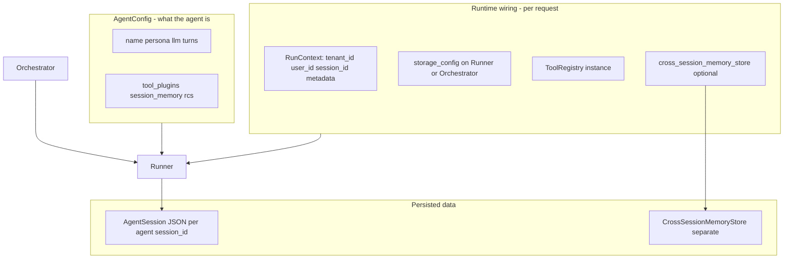

# Getting Started — Assemble and Run a Nexus Agent

Nexus is built around one idea: **describe an agent in config, wire runtime dependencies on the runner, call `run()`**. No global LLM settings, no shared agent singleton.

For a full multi-tenant SaaS layout (plans, tenants, FastAPI), see [examples/nexus_saas_api.py](examples/nexus_saas_api.py).

---

## Quick start — runnable in 5 minutes

### 1. Install

```bash
# Library only (scripts, tests — add extras as needed)
uv sync --extra dev --extra sqlite --extra file

# SaaS API example (FastAPI + session/cross-session SQLite stores)
uv sync --extra fastapi --extra sqlite
```

Optional: `uv pip install python-dotenv` so the example loads `.env` from the repo root.

### 2. Set LLM credentials (your app reads env; Nexus does not)

Copy `.env.example` to `.env` and fill in keys, or pass secrets directly in code.

For a local OpenAI-compatible server (LiteLLM, LM Studio):

```env
NEXUS_LLM_PROVIDER=openai
NEXUS_LLM_BASE_URL=http://localhost:4000
NEXUS_LLM_API_KEY=not-needed
NEXUS_LLM_MODEL=gpt-4o-mini
```

### 3. Define config → runner → run

```python
import asyncio
from pydantic import SecretStr

from nexus.config.agent import AgentConfig, AgentPersonaConfig, TurnConfig
from nexus.config.llm import LLMProviderConfig
from nexus.config.storage import SessionStorageConfig
from nexus.runner.agent_runner import AgentRunner
from nexus.tools.context import RunContext
from nexus.tools.registry import ToolRegistry
from nexus.tools.decorators import tool

@tool(name="echo")
def echo(text: str) -> str:
    """Echo back the input."""
    return text

def build_my_agent() -> AgentConfig:
    return AgentConfig(
        name="assistant",
        llm=LLMProviderConfig(
            provider="openai",
            model="gpt-4o-mini",
            api_key=SecretStr("sk-..."),  # or read from os.environ in your factory
            # base_url="http://localhost:4000",  # optional: custom endpoint
        ),
        persona=AgentPersonaConfig(
            role="Helpful assistant",
            goal="Answer clearly and use tools when useful.",
        ),
        turns=TurnConfig(max_turns=10, max_tool_calls_per_turn=5),
        tool_plugins=[],  # use registry below; list plugin *names* if using @tool_plugin
    )

async def main():
    config = build_my_agent()

    registry = ToolRegistry()
    registry.register_tool(echo)

    runner = AgentRunner(
        config=config,
        tool_registry=registry,
        storage_config=SessionStorageConfig(
            adapter="sqlite",  # use "memory" for throwaway local runs (lost on exit)
            adapter_config={"tenant_scoped": True},  # uses NEXUS_DATA_ROOT (default ./tenants)
        ),
        run_context=RunContext(tenant_id="demo", user_id="demo-user", session_id="sess-1"),
    )

    # session_id is already on RunContext; pass session_id= on run() only to override this call
    result = await runner.run(user_message="Echo hello")
    print(result.final_response)
    print("turns:", result.turns_used)

if __name__ == "__main__":
    asyncio.run(main())
```

**Assembly checklist**

1. Build `AgentConfig` (LLM, persona, turns, tools — see [What goes where](#what-goes-where)).
2. Build `ToolRegistry` and register tools.
3. `AgentRunner(config=..., tool_registry=..., storage_config=..., run_context=...)`.
4. `await runner.run(user_message=...)`.

---

## What goes where

Nexus splits **what the agent is** from **who is calling and where data lives**. Use this table as the anchor for everything below.

| Concern | Put it on | Notes |
|---------|-----------|-------|
| LLM, persona, turns, tools, session_memory, RCS | `AgentConfig` | Per agent; built once or from a factory |
| Tenant, user, default chat id, tool metadata | `RunContext` | Per HTTP request / job |
| Session persistence backend | `storage_config` on **Runner / Orchestrator** | **Preferred**; one backend per tenant for joinable history |
| Session persistence fallback | `AgentConfig.storage` | Only when runner gets no `storage_config` (minimal local scripts) |
| Cross-session user profile | `cross_session_memory_store` on runner + `RunContext.user_id` | Separate store from session JSON |



**One rule:** `AgentConfig` = behavior. Everything about *who*, *where stored*, and *which chat* = runner/orchestrator args + `RunContext`.

### Storage priority

1. `AgentRunner(storage_config=…)` / `AgentOrchestrator(storage_config=…)` — **wins**
2. else `AgentConfig.storage` (fallback)
3. else in-memory — **isolated per runner instance** (not shared across group members)

### Session ID priority (single agent)

1. `run(session_id=…)` — override for this call
2. else `RunContext.session_id`
3. else auto-generated UUID

After resolution, the runner syncs the chosen id back onto `RunContext`.

| | `AgentConfig` | `RunContext` |
|---|---------------|--------------|
| Lifetime | Built once (or per tenant template) | New per HTTP request / job |
| Holds | LLM, persona, tools, limits, session_memory, RCS | `tenant_id`, `user_id`, `session_id`, `metadata` |
| Defines the agent? | Yes | No — defines the **call** |

---

## Storage and session history

### Tenant-scoped on-disk layout

By default, file and SQLite adapters store data under **`./tenants`** (override with the **`NEXUS_DATA_ROOT`** env var):

```text
{NEXUS_DATA_ROOT}/
  _index/sessions.json
  {tenant_id}/users/{user_id}/
    sessions.db              # SQLite session adapter
    memory.db                # SQLiteCrossSessionMemoryStore
    {session_id}/session.json  # file session adapter
```

Missing `tenant_id` or `user_id` map to `_default`. Set `tenant_scoped=False` on adapter config to use legacy flat paths (`./nexus_sessions/`, single `db_path`).

### Adapters

| Adapter | Where data lives (tenant-scoped default) |
|---------|------------------------------------------|
| `memory` | In-process only; lost on exit |
| `file` | `{tenant_id}/users/{user_id}/{session_id}/session.json` |
| `sqlite` | `{tenant_id}/users/{user_id}/sessions.db` (one row per session) |

Configure via `SessionStorageConfig` on the runner/orchestrator (see [What goes where](#what-goes-where)).

### What is in each session JSON

Each persisted `AgentSession` includes:

- `turns[]` — user message, LLM messages, token counts per turn
- `tool_calls[]` per turn — `tool_name`, `tool_input`, **`raw_response`**, **`summarized_response`** (RCS), `is_dropped`
- `context_updates_received` per turn — raw `_context_updates` from the LLM
- `entity_memory`, `working_memory` — session-scoped facts (when memory curator is enabled)
- `total_tokens_saved_by_rcs` — cumulative RCS savings
- `tenant_id`, `user_id`, `agent_id`, timestamps

You can load a session and render a full timeline (user → tools → RCS summaries) from this JSON.

### Multi-agent: one JSON per member, not one group blob

The orchestrator does **not** write a merged group transcript. Each member gets its own session:

```text
group-sess-1_researcher   →  own session JSON
group-sess-1_analyst      →  own session JSON
```

Member ids are derived at orchestrator init: `{session_id_prefix}{group_session_id}_{member.name}`.

**Pipeline handoff:** member N+1 receives member N's **`final_response` string** as its `user_message` — not the full chat log.

### Joining history for a UI

To show all sub-agents in one timeline:

1. Use **one** `storage_config` for the whole group (pass it once on `AgentOrchestrator`).
2. Keep the same `tenant_id` / `user_id` on `RunContext`.
3. Load sessions by prefix, e.g. all rows where `session_id` starts with `group-sess-1_`.
4. Merge/sort by timestamp in your API layer.

Do **not** give different storage backends to group members — history will be fragmented across stores.

---

## Sessions and identity (`RunContext`)

`RunContext` is **per request / per run**, not part of `AgentConfig`. It carries who this execution belongs to and optional bag-of-data for tools.

```python
RunContext(
    tenant_id="acme",      # stored on new sessions; used for multi-tenant storage filters
    user_id="user-42",     # required for cross-session memory; stored on sessions
    session_id="sess-1",   # default chat id if you omit session_id on run()
    request_id="req-9",    # tracing / correlation (your choice)
    metadata={"plan": "pro"},  # arbitrary; tools can read via ctx.get("plan")
)
```

### When it is required

**No** — both `AgentRunner` and `AgentOrchestrator` default to an empty `RunContext()` if you omit it.

Use an explicit `RunContext` when you have **multi-tenancy**, **per-user sessions**, **cross-session memory**, or **tools that need request-scoped data** (DB handle, API client, plan flags).

For a local script with one user, you can skip it and pass `session_id=` only on `run()`.

### Tool dependency injection

If a tool declares a `RunContext` parameter, the registry injects the same context on every tool call:

```python
@tool(name="tenant_settings")
def tenant_settings(ctx: RunContext) -> str:
    return f"Settings for tenant {ctx.tenant_id}"
```

### Multi-agent: what is shared vs not

| Kind | Shared across group by default? | How to share intentionally |
|------|----------------------------------|----------------------------|
| `RunContext.tenant_id` / `user_id` | Yes (copied from orchestrator) | Pass one `RunContext` into `AgentOrchestrator` |
| `RunContext.metadata` | Yes (same values on member contexts) | Set on group `RunContext` before `run()` |
| Tool registry | No (you choose) | Pass same `ToolRegistry` instance |
| Session / turn history | No — separate JSON per member | Pipeline handoff text; or load by session id prefix for UI |
| LLM provider config | No | Each `AgentConfig.llm` is independent |

You pass **one** `RunContext` into `AgentOrchestrator`; member runners get derived session ids (`{group_session_id}_{member.name}`). There is no single merged group session object today.

**Orchestrator gotcha:** member session ids are computed in `AgentOrchestrator.__init__` from `RunContext.session_id` at construction time. Set the group `session_id` on `RunContext` **before** creating the orchestrator. Changing `session_id` only in `orchestrator.run()` updates the orchestrator's context but **does not** rewire member runners.

### Optional session metadata on `run()`

```python
await runner.run(
    user_message="Hello",
    session_id="sess-1",  # optional override
    initial_context={"deal_id": "D-99"},  # merged into session.metadata once
)
```

`initial_context` is **per runner / per session**, not propagated across group members. To pass structured state through a pipeline, embed it in the handoff message or put it in `RunContext.metadata`.

### Streaming vs blocking output

Each run is either **streaming** or **non-streaming** for the whole agent loop (LLM calls, tools, session persistence). Set the default on config; override per call.

```python
config = AgentConfig(
    name="assistant",
    llm=llm_config,
    stream_output=False,  # default: blocking AgentRunResult
)

# Blocking (JSON APIs, batch jobs)
result = await runner.run("Hello", stream=False)

# Streaming (SSE, live UIs) — yields AgentStreamEvent chunks
async for event in runner.run_stream("Hello", stream=True):
    if event.event_type == "content":
        print(event.content, end="", flush=True)
    elif event.event_type == "final_response":
        result = AgentRunResult(**event.data)
```

| Method | Resolved mode | Returns |
|--------|---------------|---------|
| `run(..., stream=None)` | `config.stream_output` unless overridden | `AgentRunResult` |
| `run_stream(..., stream=None)` | same resolution | `AsyncIterator[AgentStreamEvent]` |

`AgentGroupConfig.stream_output` and `AgentOrchestrator.run_stream()` follow the same pattern for multi-agent groups. The SaaS example accepts `"stream": true` on `ChatRequest` and returns Server-Sent Events from `/v1/chat`.

---

## Per-agent LLM providers

Put the provider on **each** `AgentConfig`, not in a global setting:

```python
researcher = AgentConfig(
    name="researcher",
    llm=LLMProviderConfig(provider="openai", model="gpt-4o", api_key=...),
    ...
)

writer = AgentConfig(
    name="writer",
    llm=LLMProviderConfig(provider="anthropic", model="claude-3-5-sonnet-20241022", api_key=...),
    ...
)
```

In production, a **config factory** (like `NexusTenantConfigFactory` in the SaaS example) maps tenant/plan → `LLMProviderConfig` + tool allow-list + session_memory flags, then returns `AgentConfig`. **Storage** resolves at the tenant/request layer on the runner, not on `AgentConfig`.

Each config can use a **different** `LLMProviderConfig` (OpenAI, Anthropic, LiteLLM proxy, LM Studio, etc.). That is how you give one agent GPT-4o and another Claude on the same app — two configs, two runners (or one group — see below).

---

## Multi-agent groups

`AgentGroupConfig` does **not** define an LLM for the whole group. It only defines orchestration: `pattern`, `members`, `max_turns`, group-level `rcs`, etc.

**Providers live on each `AgentConfig` in `members`.** Build one full config per agent (each with its own `llm=LLMProviderConfig(...)`), then pass those configs into the group:

```python
from pydantic import SecretStr
from nexus.config.agent import AgentConfig, AgentGroupConfig, AgentPersonaConfig
from nexus.config.llm import LLMProviderConfig
from nexus.config.storage import SessionStorageConfig
from nexus.multiagent.orchestrator import AgentOrchestrator
from nexus.tools.context import RunContext
from nexus.tools.registry import ToolRegistry

registry = ToolRegistry()
# registry.register_plugin(WebSearchPlugin())  # register your plugins

storage_config = SessionStorageConfig(
    adapter="sqlite",
    adapter_config={"tenant_scoped": True},
)

# Member 1: OpenAI for search-heavy work
researcher_cfg = AgentConfig(
    name="researcher",
    llm=LLMProviderConfig(
        provider="openai",
        model="gpt-4o",
        api_key=SecretStr("sk-openai-..."),
    ),
    persona=AgentPersonaConfig(role="Researcher", goal="Gather facts with web search."),
    tool_plugins=["web_search"],
)

# Member 2: Anthropic for analysis
analyst_cfg = AgentConfig(
    name="analyst",
    llm=LLMProviderConfig(
        provider="anthropic",
        model="claude-3-5-sonnet-20241022",
        api_key=SecretStr("sk-ant-..."),
    ),
    persona=AgentPersonaConfig(role="Analyst", goal="Structure findings into a report."),
    tool_plugins=["database"],
)

group = AgentGroupConfig(
    name="research_pipeline",
    pattern="pipeline",
    members=[researcher_cfg, analyst_cfg],
    max_turns=20,
)

orchestrator = AgentOrchestrator(
    config=group,
    tool_registry=registry,
    storage_config=storage_config,  # once — all members inherit the same store
    run_context=RunContext(tenant_id="acme", user_id="user-1", session_id="group-sess-1"),
)

result = await orchestrator.run(user_message="Analyze Q4 revenue")
```

The orchestrator creates one `AgentRunner` per member; each runner uses **that member's** `config.llm`. Member session IDs are `{prefix}{group_session_id}_{member.name}` (e.g. `group-sess-1_researcher`, `group-sess-1_analyst`). See [Storage and session history](#storage-and-session-history) for loading joined history.

| Config type | Has `llm`? | Role |
|-------------|------------|------|
| `AgentConfig` | Yes — **this agent's** provider/model/key | Runnable agent |
| `AgentGroupConfig` | No (only optional group `rcs` compactor LLM) | Wires `members` + `pattern` |

---

## Tool registry

The LLM never calls Python functions directly. Nexus needs a **`ToolRegistry`**: a catalog of callables with JSON schemas that get sent to the model, then executed when the model requests a tool.

```
  @tool on a function/method
           │
           ▼
  registry.register_tool(fn)     or     registry.register_plugin(MyPlugin())
           │
           ▼
  AgentRunner asks registry for schemas → LLM picks a tool → registry.execute(...)
```

`AgentRunner` **requires** a `tool_registry` argument. There is no "pass a list of raw functions into the runner" API — you decorate, then register.

### Standalone `@tool` functions

```python
from nexus.tools.decorators import tool

@tool(name="echo", description="Echo text back")
def echo(text: str) -> str:
    return text

registry = ToolRegistry()
registry.register_tool(echo)  # stored as "global.echo" by default
```

Standalone functions live under the **`global`** plugin namespace unless you pass `plugin_name=`:

```python
registry.register_tool(echo, plugin_name="utilities")  # → "utilities.echo"
```

### `@tool_plugin` classes

Use a **plugin class** when you have several related tools, shared state, or a clear namespace (matches `AgentConfig.tool_plugins`):

```python
@tool_plugin(name="web_search")
class WebSearchPlugin:
    @tool(name="search")
    def search(self, query: str) -> str:
        return f"Results for {query}"
```

```python
registry.register_plugin(WebSearchPlugin())
# LLM sees tool name: web_search.search
```

| Approach | Register with | LLM tool name | Good for |
|----------|---------------|---------------|----------|
| One-off function | `register_tool(fn)` | `global.echo` (default) | Scripts, 1–2 tools |
| Plugin class | `register_plugin(instance)` | `web_search.search` | SaaS tool packs, grouping, `tool_plugins` gating |

### `AgentConfig.tool_plugins` — allow-list, not registration

- **Registry** = everything your app *could* expose.
- **`tool_plugins`** = which plugin namespaces *this agent* may see (filtered in `get_tool_schemas_for_llm`).

```python
AgentConfig(
    name="researcher",
    tool_plugins=["web_search"],  # only web_search.* tools go to the LLM
    ...
)
```

| `tool_plugins` value | Effect |
|--------------------|--------|
| `[]` (default) | No filter — all registered tools are eligible |
| `["web_search", "database"]` | Only tools from those plugin namespaces |

The SaaS example registers all plugins once (`SHARED_TOOL_REGISTRY`) and each agent config allow-lists via plan (`allowed_tool_plugins`).

### One registry, many agents

Build **one** `ToolRegistry` at app startup, pass the **same instance** into every `AgentRunner` / `AgentOrchestrator`. Per-agent differences come from `tool_plugins` on each `AgentConfig`, not from separate registries.

```python
SHARED = ToolRegistry()
SHARED.register_plugin(WebSearchPlugin())
SHARED.register_plugin(DatabasePlugin())

runner_a = AgentRunner(config=cfg_a, tool_registry=SHARED)  # cfg_a.tool_plugins = ["web_search"]
runner_b = AgentRunner(config=cfg_b, tool_registry=SHARED)  # cfg_b.tool_plugins = ["database"]
```

---

## Memory

Nexus has **three** memory channels (session entity, session working, cross-session profile). The easy mistake is treating "entity memory" and "cross-session memory" as the same thing — they are both key/value facts, but scoped differently.

### Overview — three channels

| Question | Use this | Config / wiring |
|----------|----------|-----------------|
| "Remember this **for the rest of this chat**?" | **Session memory** | `session_memory.entity` + `session_memory.working` on `AgentSession` (same `session_id`) |
| "Remember this **for this user next time they open a new chat**?" | **Cross-session memory** | `session_memory.cross_session` + `CrossSessionMemoryStore` + `RunContext.user_id` |
| "Search a large document corpus?" | **Your RAG tool** | Custom tool + vector DB (Pinecone, pgvector, etc.) — not built into Nexus |

```text
Same user, new session_id
─────────────────────────
  Cross-session memory      →  loaded at run start  →  "About this user (across conversations)"
  Session memory (chat)     →  starts empty         →  "Known Facts (this conversation)"

Same session_id, next turn
──────────────────────────
  Session memory            →  updated by curator after each turn
  Cross-session memory      →  also updated when curator saves (if cross_session.enabled)
```

**Session memory** lives on the conversation record (`AgentSession` JSON). **Cross-session memory** lives in a separate store keyed by `tenant_id` + `user_id` + namespace (default namespace = agent name). See [What goes where](#what-goes-where).

### Session memory vs cross-session memory

| Channel | Plain name | Stored on | Survives new `session_id`? | In system prompt? |
|---------|------------|-----------|----------------------------|-------------------|
| **Cross-session memory** | User profile facts | `CrossSessionMemoryStore` (sqlite, or **your own** backend) | **Yes** (with a persistent store) | Yes — "About this user (across conversations)" |
| **Session entity memory** | This-chat facts | `session.entity_memory` | No — tied to one chat | Yes — "Known Facts (this conversation)" |
| **Session working memory** | This-chat scratchpad | `session.working_memory` | No | Yes — "Your Working Notes" |

The curator writes **session** facts first; if `session_memory.cross_session.persist_from_curator` is on, those facts are **copied/merged** into the cross-session store — there is no second extraction LLM call for cross-session memory.

### When to use which

- **Session entity + working** — small summary the agent should always see **inside one conversation** (current task notes + facts from this thread).
- **Cross-session memory** — durable profile facts for a **returning user** (preferences, name, plan tier) across many chats. Needs `user_id` on every request.
- **Large corpora / semantic search** — use a **custom RAG tool** wired to your vector store; Nexus does not ship a built-in vector memory layer.

### When to skip session memory entirely

If you prompt the **RCS compactor** to preserve meaningful facts from tool responses and conversation turns — not just that tools were called — you may not need the session curator at all. The rolling summary can carry forward what matters after old turns are compacted.

Session memory is **fully opt-out**: set `session_memory.enabled=False`, or leave both `session_memory.entity.enabled` and `session_memory.working.enabled` false. The curator never runs (`MemoryCurator.active` is false) and **no extra LLM call** is made per turn.

Use session entity/working memory when you want **structured, capped, reliably-injectable** facts in dedicated prompt blocks, without depending on compactor summary quality.

### Enable on `AgentConfig`

**Session curator** (writes session memory) requires:

- `session_memory.enabled=True`
- At least one of `session_memory.entity.enabled` or `session_memory.working.enabled`

**Cross-session memory** (read + persist across sessions) additionally requires:

- `session_memory.cross_session.enabled=True`
- A **`cross_session_memory_store`** passed into `AgentRunner` / `AgentOrchestrator`
- **`RunContext.user_id`** set on every run (and usually `tenant_id`)

If `cross_session.enabled` is true but `user_id` or `cross_session_memory_store` is missing, cross-session memory is silently skipped; session memory still works.

```python
from nexus.config.memory import (
    SessionMemoryConfig,
    EntityMemoryConfig,
    WorkingMemoryConfig,
    CrossSessionMemoryConfig,
)
from nexus.memory import SQLiteCrossSessionMemoryStore

CROSS_SESSION_STORE = SQLiteCrossSessionMemoryStore()  # per-user memory.db under NEXUS_DATA_ROOT

AgentConfig(
    name="assistant",
    llm=...,
    session_memory=SessionMemoryConfig(
        enabled=True,
        entity=EntityMemoryConfig(enabled=True, max_entities=50),
        working=WorkingMemoryConfig(enabled=True, max_length=2000),
        cross_session=CrossSessionMemoryConfig(enabled=True),
    ),
)

runner = AgentRunner(
    config=...,
    tool_registry=registry,
    storage_config=...,  # session JSON lives here — see What goes where
    cross_session_memory_store=CROSS_SESSION_STORE,
    run_context=RunContext(tenant_id="acme", user_id="user-42"),
)
```

### Cross-session memory stores (built-in + your own)

`cross_session_memory_store` is **pluggable**. The framework only calls three async methods — any class that implements them can be passed to `AgentRunner` / `AgentOrchestrator` (duck typing; no base class required).

| Built-in | When to use |
|----------|-------------|
| **`InMemoryCrossSessionMemoryStore`** | Unit tests, local dev (lost on process exit) |
| **`SQLiteCrossSessionMemoryStore`** | Single-server apps, simple persistence (`uv pip install aiosqlite`) |

There is **no** first-party PostgreSQL (or Redis) cross-session adapter yet. For those backends, implement your own store or wrap an existing DB client.

**`CrossSessionMemoryStore` contract** ([`nexus/memory/cross_session_store.py`](nexus/memory/cross_session_store.py)):

- `load(tenant_id, user_id, namespace) -> CrossSessionMemoryRecord | None`
- `save(record: CrossSessionMemoryRecord) -> None`
- `merge_entities(tenant_id, user_id, namespace, entities, *, max_entities) -> CrossSessionMemoryRecord`

Use `make_cross_session_memory_key(tenant_id, user_id, namespace)` so keys stay consistent with the built-in stores (`{tenant}:{user}:{namespace}`).

```python
from nexus.memory.cross_session_store import (
    CrossSessionMemoryRecord,
    make_cross_session_memory_key,
)

class MyPostgresCrossSessionMemoryStore:
    """Example skeleton — wire to your DB in load/save/merge_entities."""

    async def load(self, tenant_id, user_id, namespace):
        key = make_cross_session_memory_key(tenant_id, user_id, namespace)
        row = await self._fetch(key)  # your code
        return CrossSessionMemoryRecord(**row) if row else None

    async def save(self, record: CrossSessionMemoryRecord) -> None:
        await self._upsert(make_cross_session_memory_key(
            record.tenant_id, record.user_id, record.namespace
        ), record.model_dump())

    async def merge_entities(
        self, tenant_id, user_id, namespace, entities, *, max_entities
    ) -> CrossSessionMemoryRecord:
        existing = await self.load(tenant_id, user_id, namespace)
        if existing is None:
            existing = CrossSessionMemoryRecord(
                tenant_id=tenant_id, user_id=user_id, namespace=namespace
            )
        if entities:
            merged = {**existing.entity_memory, **entities}
            existing.entity_memory = dict(list(merged.items())[-max_entities:])
        await self.save(existing)
        return existing

runner = AgentRunner(..., cross_session_memory_store=MyPostgresCrossSessionMemoryStore(dsn="..."))
```

Copy [`InMemoryCrossSessionMemoryStore`](nexus/memory/cross_session_store.py) or [`SQLiteCrossSessionMemoryStore`](nexus/memory/cross_session_store.py) as a starting point if you prefer not to implement `merge_entities` from scratch.

Caps keep memory small:

- **Session:** `session_memory.entity.max_entities`, `session_memory.working.max_length`
- **Cross-session:** `session_memory.cross_session.max_entities` (separate cap on the profile store)

**Curator timing (defaults):** runs **after each completed turn**, so the *next* turn's system prompt includes updated session memory. The cross-session store is updated in the same pass when `session_memory.cross_session.enabled`. Set `extract_after_each_turn=False` and `extraction_interval=N` to curate less often (cheaper).

### Memory curator (writer)

One optional **LLM call** per curation (like the RCS compactor) extracts JSON facts into **session** `entity_memory` / `working_memory`. With **`session_memory.cross_session.enabled`**, the framework then merges session entities into **`CrossSessionMemoryStore`** — you do not configure a separate cross-session curator.

- **`curator_llm`** — use a cheaper/smaller model than the main agent.
- **`curator_prompt`** — override what to extract and how (default: `DEFAULT_SESSION_MEMORY_CURATOR_PROMPT`).
- **`curator_agent`** — advanced: run a full `AgentConfig` as the curator (its own tools/persona); recursion is disabled on that sub-agent.

```python
session_memory=SessionMemoryConfig(
    enabled=True,
    entity=EntityMemoryConfig(enabled=True),
    curator_llm=LLMProviderConfig(provider="openai", model="gpt-4o-mini", api_key=...),
    curator_prompt="Extract only billing-related facts as JSON ...",
)
```

Set **`inject_into_prompt=False`** if you only want the curator to write storage but not show memory in the system prompt.

---

## Run the bundled SaaS API example

From the repo root (install **`fastapi`** and **`sqlite`** extras first — the example uses `SQLiteCrossSessionMemoryStore`, which needs `aiosqlite` from the `sqlite` extra):

```bash
uv sync --extra fastapi --extra sqlite
uv run uvicorn examples.nexus_saas_api:app --host 0.0.0.0 --port 8000
```

Single agent:

```bash
curl -X POST http://localhost:8000/v1/chat \
  -H "Content-Type: application/json" \
  -H "X-Tenant-ID: pro_tenant_1" \
  -d '{"message": "Search for Nexus framework releases"}'
```

Multi-agent (PRO/ENTERPRISE tenants only):

```bash
curl -X POST http://localhost:8000/v1/multi-agent/run \
  -H "Content-Type: application/json" \
  -H "X-Tenant-ID: pro_tenant_1" \
  -d '{"message": "Research and analyze our churn"}'
```

That example's flow: resolve tenant → build `AgentConfig` → **`storage_config` on runner/orchestrator** (per tenant) → run → return JSON.

---

## Quick reference

### `AgentConfig` fields

| Field | Purpose |
|-------|---------|
| `name` | Agent id (sessions, logging) |
| `llm` | **Provider + model + key** for this agent only |
| `persona` | `role` / `goal` system framing |
| `turns` | `max_turns`, `max_tool_calls_per_turn` |
| `tool_plugins` | Allow-list of plugin namespaces (see Tool registry) |
| `session_memory` | Curator + session (`entity`/`working`) + cross-session promotion; see Memory section |
| `rcs` | Long-context summarization (optional) |
| `storage` | Optional fallback when runner has no `storage_config` — prefer runner-level storage in production |

### `AgentRunner` / `AgentOrchestrator` constructor args

| Arg | Purpose |
|-----|---------|
| `config` | `AgentConfig` or `AgentGroupConfig` |
| `tool_registry` | Registered tools (required for runner) |
| `storage_config` | **Preferred** — session persistence backend (`SessionStorageConfig` or `SessionManager`) |
| `run_context` | `tenant_id`, `user_id`, `session_id`, `metadata` for this request |
| `cross_session_memory_store` | Cross-session profile store (when `session_memory.cross_session.enabled`) |

---

## Next reads

- [examples/nexus_saas_api.py](examples/nexus_saas_api.py) — multi-tenant FastAPI, plan gating, per-tenant storage
- [NEXUS_AGENT_PRD.md](NEXUS_AGENT_PRD.md) — full product/design spec
