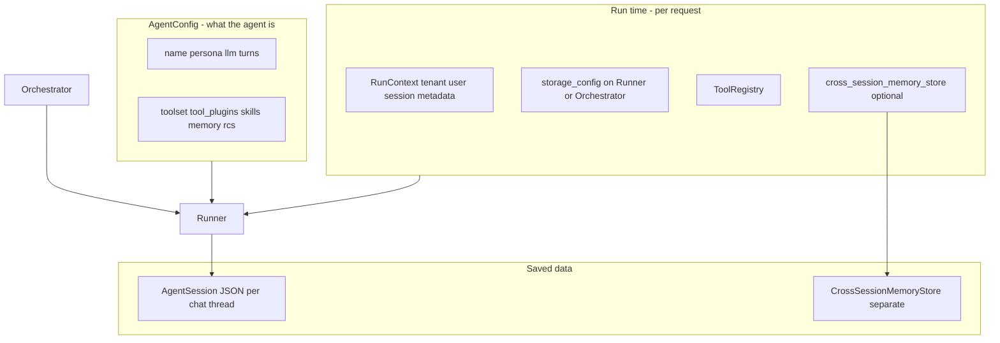
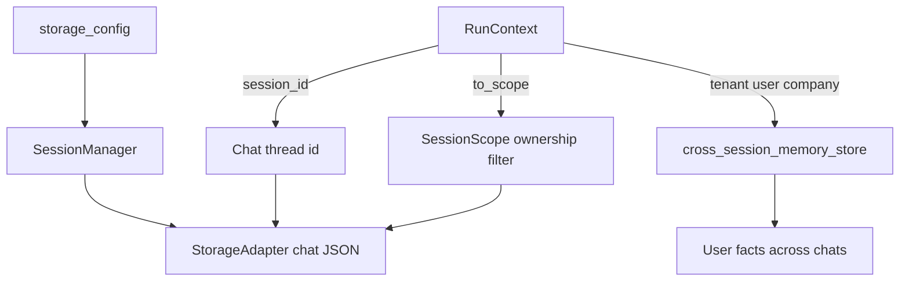
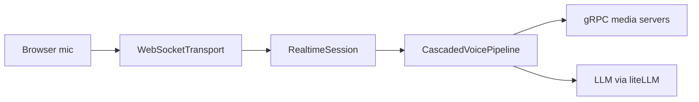

# Architecture: what goes where

**Who this is for:** Anyone wiring Nexus for the first time who needs to know which settings belong in which object.

## Key terms

- **Agent config** (`AgentConfig`) — Describes what the agent is: model, personality, turn limits, toolset, memory, summarization.
- **Run context** (`RunContext`) — Describes this specific call: which customer, which user, which chat thread.
- **Runner** (`AgentRunner`) — Runs one agent. You pass config, tools, storage, and run context into it.
- **Orchestrator** (`AgentOrchestrator`) — Runs a team of agents in a pattern (supervisor or pipeline).
- **Storage config** (`storage_config`) — Wires where chat history JSON is saved: a `SessionStorageConfig` or a ready `SessionManager`.
- **Tool registry** — A catalog of tools the LLM can call. You register tools here before running.

## One rule

**Agent config = behavior.** **Run context + runner args = who, where, and which chat.**

Nexus splits “what the agent is” from “who is using it and where data lives”. This makes multi-tenant SaaS apps straightforward.

## Concern table

| Concern | Put it on | Notes |
|---------|-----------|-------|
| LLM, persona, turns, toolset, skills, memory, RCS, context summary | `AgentConfig` | Built once per agent template |
| Within-chat turn compression | `context_summary` on `AgentConfig` | Folds oldest turns into `summary_text` when context fill exceeds `summarize_on` |
| Within-chat tool output compression | `rcs` on `AgentConfig` | Summarizes large tool results in context |
| Tenant, user, chat id, extra metadata | `RunContext` | New per HTTP request or job |
| Chat history backend | `storage_config` on runner or orchestrator | Preferred in production |
| Chat history fallback | `AgentConfig.storage` | Only when runner has no `storage_config` |
| Cross-chat user memory | `cross_session_memory_store` on runner + `RunContext.user_id` | Separate from session JSON |

## Four objects people mix up

When you wire a multi-tenant SaaS app, four names sit next to each other on `AgentRunner`. They answer different questions.

| Object | Answers | Is it the chat thread? |
|--------|---------|------------------------|
| `RunContext` | Who is calling, which chat id, flags, metadata, services | Holds `session_id` (the chat thread id) |
| `SessionScope` | Ownership **filter** for storage ops (`tenant_id` / `company_id` / `user_id`) | No — does not include `session_id` |
| `storage_config` | Where/how **chat history JSON** is saved | Config (`SessionStorageConfig`) or a ready `SessionManager` |
| `cross_session_memory_store` | Where **user facts** live across chat threads | Separate store — not chat JSON |

**Common mistakes:**

- `SessionScope` is **not** the chat session. The chat thread is `session_id` on `RunContext` / `AgentSession`. Scope is only “whose rows may I touch?” when loading or listing.
- `SessionScope` is **not** “the SaaS user.” It is an optional filter on up to three identity fields. Products choose dimensions (for example tenant + company, or tenant + user).
- `storage_config` is **not** the adapter. The adapter is `StorageAdapter`. The runner arg either describes which adapter to build or passes a ready `SessionManager` that already wraps one.
- `cross_session_memory_store` is **not** `SessionScope` and **not** chat history. It holds durable key/value facts keyed by tenant + user + namespace (optional company).

Details: [Run context](reference/run-context.md), [Storage](reference/storage.md), [Memory](reference/memory.md).

## Storage priority

1. `AgentRunner(storage_config=…)` or `AgentOrchestrator(storage_config=…)` — **wins**
2. Else `AgentConfig.storage` — fallback
3. Else in-memory — **not shared** across team members

## Chat thread id priority (single agent)

1. `run(session_id=…)` — override for this call only
2. Else `RunContext.session_id`
3. Else auto-generated UUID

After resolution, the runner copies the chosen id back onto `RunContext`.

## Multi-agent teams

- Each team member gets its own chat history file (not one merged blob).
- Member chat ids look like `{group_chat_id}_{member_name}` (for example `team-1_researcher`).
- In a **pipeline**, the next agent receives the previous agent’s final text reply as its input message.

**Important:** For teams, set `RunContext.session_id` **before** you create the orchestrator or `OrchestrationRuntime`. Member chat ids are fixed at construction time.

## YAML orchestration vs Python API

| Approach | Best when |
|----------|-----------|
| YAML manifest + `OrchestrationRuntime` | You want declarative config, env-based secrets, or ops-owned agent definitions |
| Python `AgentConfig` + `AgentRunner` | You build config in code (factories per tenant/plan) |

Both paths use the same underlying types. See [getting-started.md](getting-started.md) and [getting-started-python.md](getting-started-python.md).

## Voice agents (RealtimeRuntime)

Text agents use `OrchestrationRuntime` or `AgentRunner`. Voice agents use
`RealtimeRuntime`, which wraps the same `AgentConfig` with media settings
(STT, TTS, VAD, duplex mode).

| Approach | Best when |
|----------|-----------|
| YAML manifest + `RealtimeRuntime` | You declare `servers:`, `modality: voice_cascaded`, and `server_ref` in config |
| Python `CascadedVoicePipeline` | You build the pipeline in code and attach a transport yourself |

**Canonical example:** [Voice Lab](../guides/voice-lab.md) — `./scripts/run_voice_lab.sh` starts gRPC media servers and a browser UI at http://localhost:8787.

- Manifest: `examples/orchestration/voice_grpc.yaml`
- Media servers: `examples/servers.yaml`
- Python wiring: `examples/voice_lab.py`

**Alternate voice patterns** (still on the same core):

- Half-duplex IVR: `ivr_support.yaml`
- Voice teams: `voice_team_support.yaml`
- Speech-to-speech: `voice_s2s_local.yaml`

See [pipelines guide](../guides/pipelines.md) and [realtime-agents reference](reference/realtime-agents.md).

## Related guides

- [Pipelines](../guides/pipelines.md) — which pipeline to run (text, voice, teams)
- [Runtime control](../guides/runtime-control.md) — take charge when tools or tenant state change

## Next steps

- [Getting started (YAML)](getting-started.md)
- [Getting started (Python)](getting-started-python.md)
- [Run context reference](reference/run-context.md)
- [Storage reference](reference/storage.md)
- [Memory reference](reference/memory.md)
