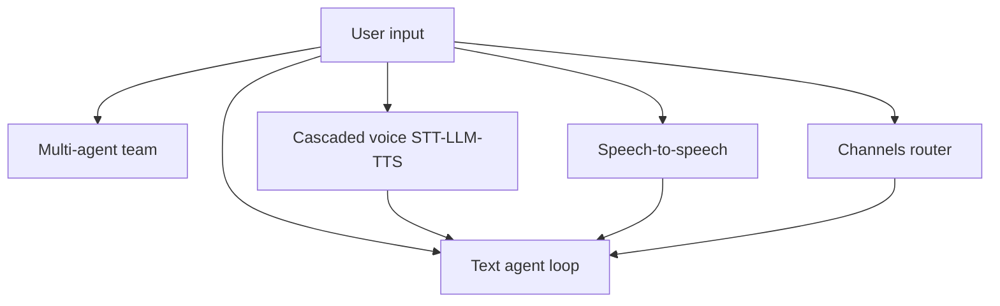

# Pipelines: choose and run the right flow

**Who this is for:** Developers who need to pick a Nexus pipeline (text, multi-agent, voice, or channels) and know which example to run.

## Key terms

- **Pipeline** — A fixed sequence of stages that turn user input into a reply. Nexus offers several; you pick one per use case.
- **Agent loop** — The text pattern: LLM → maybe tools → LLM again until done (ReAct).
- **Modality** — How media is handled: `text`, `vision_text`, `voice_cascaded`, `voice_s2s`.
- **Pattern** — How multi-agent teams coordinate: `supervisor`, `pipeline`, `parallel`, `voice_team`.
- **Transport** — How audio moves between client and server (WebSocket, phone/SIP, WebRTC).

## Why this guide exists

Nexus is not one pipeline — it is a toolkit. The same agent config (persona, tools, memory) can run as plain text, inside a team, or behind a voice stack. This page maps **what each pipeline does**, **when to use it**, and **where the runnable examples live**.

For full parameter tables, follow the links to `docs/reference/`. For taking charge when tool results or tenant state change, see [runtime-control.md](runtime-control.md).

## Quick decision table

| Your goal | Pipeline | Entry point |
|-----------|----------|-------------|
| Chat agent with tools (text) | Text agent loop | `AgentRunner` or `OrchestrationRuntime` |
| Lead agent delegates to specialists | Multi-agent `supervisor` | YAML `groups.pattern: supervisor` |
| Fixed step-by-step workflow | Multi-agent `pipeline` | YAML `groups.pattern: pipeline` |
| Same question to several agents at once | Multi-agent `parallel` | YAML `groups.pattern: parallel` |
| Voice: separate STT, LLM, TTS stages | Cascaded voice | `CascadedVoicePipeline`, `modality: voice_cascaded` |
| Voice: one realtime audio model | Speech-to-speech (S2S) | `SpeechToSpeechPipeline`, `modality: voice_s2s` |
| Voice team (responder + silent lookup agent) | Voice team | `VoiceTeam`, `pattern: voice_team` |
| Images + text | Vision | `VisionAgentRunner`, `modality: vision_text` |
| Telegram / WhatsApp / voice notes | Channels | `ChannelRouter` + channel adapter |
| Phone IVR menus | Cascaded + IVR tools | `ivr_support.yaml`, `duplex: half` |



Every voice and channel pipeline still runs the **text agent loop** at the LLM stage. Your tools, memory, and persona stay the same.

---

## 1. Text agent loop (ReAct)

**What it does:** Send messages to the LLM. If the model requests tools, run them, append results, and call the LLM again. Stop when the model returns plain text (or you hit `max_turns`).

**When to use it:** Default for chat APIs, backends, and any non-voice agent.

**How to run:**

```python
from nexus import AgentRunner, RunContext

runner = AgentRunner(config=agent_config, tool_registry=registry, run_context=ctx)
result = await runner.run("What is the weather in Paris?")
print(result.final_response)
```

**YAML equivalent:** Set `root` to a single agent name in your manifest, then use `OrchestrationRuntime.from_manifest()`.

| Parameter | Where | Notes |
|-----------|-------|-------|
| `max_turns` | `AgentConfig.turns` | Caps loop iterations |
| `stop_on_empty_tool_calls` | `TurnConfig` | Stop when LLM returns no tool calls (default `True`) |
| `tool_plugins` | `AgentConfig` | Allow-list of tool namespaces |

**Examples:** [examples/orchestration/run_team.py](../../examples/orchestration/run_team.py) (single agent variant), [getting-started.md](../getting-started.md).

**Reference:** [agent-runner.md](../reference/agent-runner.md), [agent-config.md](../reference/agent-config.md).

---

## 2. Multi-agent teams

Teams wrap multiple `AgentConfig` members. The **pattern** decides how work flows between them.

### Supervisor (LLM picks the next agent)

**What it does:** The lead agent gets `delegate_to_{member}` tools. The LLM chooses which member to call and when.

**When to use it:** Dynamic routing — the right specialist depends on the user's question.

```yaml
groups:
  research_team:
    pattern: supervisor
    members: [supervisor, researcher, analyst]
```

**Examples:** [research_team.yaml](../../examples/orchestration/research_team.yaml).

### Pipeline (fixed order)

**What it does:** Members run one after another. Member N+1 receives member N's **`final_response` string** as its input — not the full chat log.

**When to use it:** Predictable workflows (research → analyze → summarize).

```yaml
groups:
  analysis_pipeline:
    pattern: pipeline
    members: [researcher, analyst, writer]
```

**Examples:** Nested groups in [research_team.yaml](../../examples/orchestration/research_team.yaml).

### Parallel (same input, combine outputs)

**What it does:** Every member runs on the same `user_message` concurrently. Results are merged per `aggregation_strategy` (`concat` or `first_complete`).

**When to use it:** Multiple independent opinions on one question (e.g. two reviewers).

```yaml
groups:
  review_panel:
    pattern: parallel
    aggregation_strategy: concat
    members: [reviewer_a, reviewer_b]
```

**Reference:** [multi-agent.md](../reference/multi-agent.md), [manifest-schema.md](../reference/manifest-schema.md).

**Not implemented:** `swarm` falls back to `pipeline` with a warning.

---

## 3. Cascaded voice (STT → LLM → TTS)

**What it does:** Modular stages — voice activity detection (VAD) → speech-to-text (STT) → text agent loop → text-to-speech (TTS). Audio can stream out sentence-by-sentence before the full reply is ready.

**When to use it:** You want to swap STT/TTS providers, run fully local models, or need half-duplex phone (IVR) flows.

**Manifest:**

```yaml
modality: voice_cascaded
stt: {provider: openai, model: whisper-1}
tts: {provider: openai, model: tts-1}
vad: {provider: energy}
duplex: full   # or half for IVR
```

**Python:**

```python
from nexus.realtime import CascadedVoicePipeline

pipeline = CascadedVoicePipeline(rt_config, storage_config=session_manager)

# One audio blob (half-duplex / voice note):
async for ev in pipeline.process_utterance(wav_bytes, session_id="s1"):
    ...

# Already-transcribed text:
async for ev in pipeline.process_text("book a flight", session_id="s1"):
    ...
```

| Method | Use case |
|--------|----------|
| `process_text` | Text in, audio + text events out |
| `process_utterance` | One WAV/WebM blob (push-to-talk) |
| `process_audio_stream` | Continuous mic stream; `duplex: full` enables barge-in |

**Examples:**

| Example | What it demonstrates |
|---------|---------------------|
| [realtime_local_voice.py](../../examples/realtime_local_voice.py) | CLI one-shot local turn (`--check` probes servers) |
| [realtime_local_voice_ui.py](../../examples/realtime_local_voice_ui.py) | Browser push-to-talk (STT→LLM→TTS) |
| [realtime_browser_voice.py](../../examples/realtime_browser_voice.py) | Full-duplex WebSocket with barge-in |
| [voice_local.yaml](../../examples/orchestration/voice_local.yaml) | English: Whisper + Kokoro + Ollama |
| [voice_local_indic.yaml](../../examples/orchestration/voice_local_indic.yaml) | Hindi cascaded stack |
| [ivr_support.yaml](../../examples/orchestration/ivr_support.yaml) | Half-duplex phone menus |

**Self-hosted profiles:** [VOICE_PROFILES.md](../../examples/orchestration/VOICE_PROFILES.md).

**Reference:** [realtime-agents.md](../reference/realtime-agents.md), [environment.md](../reference/environment.md) (`NEXUS_STT_*`, `NEXUS_TTS_*`).

---

## 4. Speech-to-speech (S2S)

**What it does:** One realtime model takes audio in and returns audio out. Nexus still bridges your **tools** and **persona** to the model's function-calling layer.

**When to use it:** Low-latency duplex conversation with a single model (OpenAI Realtime, Moshi, Human-1).

**Manifest:**

```yaml
modality: voice_s2s
s2s: {provider: moshi, base_url: http://localhost:8998}
duplex: full
```

**Python:**

```python
from nexus.realtime import SpeechToSpeechPipeline

pipeline = SpeechToSpeechPipeline(rt_config, tool_registry=registry, run_context=ctx)
async for ev in pipeline.process_audio_stream(audio_frames):
    ...
```

**Examples:**

| Example | What it demonstrates |
|---------|---------------------|
| [realtime_s2s_ui.py](../../examples/realtime_s2s_ui.py) | Browser UI streaming PCM to Moshi/Human-1 |
| [voice_s2s_local.yaml](../../examples/orchestration/voice_s2s_local.yaml) | S2S manifest (`NEXUS_S2S_PROVIDER`) |

**Reference:** [realtime-agents.md § S2S](../reference/realtime-agents.md).

---

## 5. Voice team (responder + context agent)

**What it does:** A **responder** speaks with the user. An optional **context_agent** silently looks up facts each turn and injects them into the responder's prompt. Optional **listener** handles a dedicated transcription path.

**When to use it:** Voice support where a fast talker needs a slower lookup agent behind the scenes.

```yaml
groups:
  support_team:
    pattern: voice_team
    context_injection_var: live_context
    members:
      - {name: responder, role: responder}
      - {name: context_agent, role: context_agent}
```

```python
team = RealtimeRuntime.from_manifest(manifest, run_context=ctx).build_voice_team("support_team")
async for ev in team.process_text("where is my order"):
    ...
```

**Example:** [voice_team_support.yaml](../../examples/orchestration/voice_team_support.yaml).

---

## 6. Vision (images + text)

**What it does:** `VisionAgentRunner` wraps `AgentRunner` and sends images in the user message as multimodal content. Text-only inputs behave like the normal runner.

```python
from nexus.realtime import VisionAgentRunner, UserInput

runner = VisionAgentRunner(config=agent_config, tool_registry=registry)
result = await runner.run(UserInput.from_image_bytes(png_bytes, text="What's in this photo?"))
```

**When to use it:** Photo analysis, screenshot QA, or channel messages with image attachments.

**Reference:** [realtime-agents.md § Vision](../reference/realtime-agents.md).

---

## 7. Messaging channels

**What it does:** A **channel adapter** (Telegram, WhatsApp, etc.) normalizes provider payloads to `UserInput`, runs your agent, and sends the reply back. Voice notes are transcribed via STT; images route to `VisionAgentRunner`.

```python
from nexus.channels import ChannelRouter, TelegramAdapter

router = ChannelRouter(
    adapter=TelegramAdapter(token),
    executor_factory=lambda ctx: AgentRunner(config, registry, sm, ctx),
    stt=stt,
)
output = await router.handle(update_payload)
```

**When to use it:** Bots on messaging platforms where each inbound message is one agent turn.

**Example:** [realtime_saas_api.py](../../examples/realtime_saas_api.py) — `POST /v1/channels/{name}/webhook`.

**Reference:** [realtime-agents.md § Channels](../reference/realtime-agents.md).

---

## 8. Transports (voice I/O)

Transports move audio between the client and a voice pipeline. Bind with `RealtimeSession`:

```python
from nexus.realtime import RealtimeSession

session = RealtimeSession(pipeline, transport, session_id="call-1")
await session.run_audio()
```

| Transport | Use case |
|-----------|----------|
| `WebSocketTransport` | Browser PCM16 |
| `TwilioMediaStreamTransport` | Phone via Twilio/SIP (mu-law 8 kHz) |
| `LiveKitTransport` | WebRTC |
| `InMemoryTransport` | Tests |

**Production wiring:** [realtime_saas_api.py](../../examples/realtime_saas_api.py) — sessions, voice WebSocket, Twilio.

---

## Full example index

See [examples.md](../examples.md) for the complete table. Voice-related rows are grouped under "Realtime and voice".

## Next steps

- [Runtime control](runtime-control.md) — take charge when tool results or tenant state change
- [Realtime reference](../reference/realtime-agents.md) — providers, env vars, SaaS endpoints
- [Multi-agent reference](../reference/multi-agent.md) — member chat ids, shared vs separate state
- [Getting started](../getting-started.md) — YAML orchestration quick path
