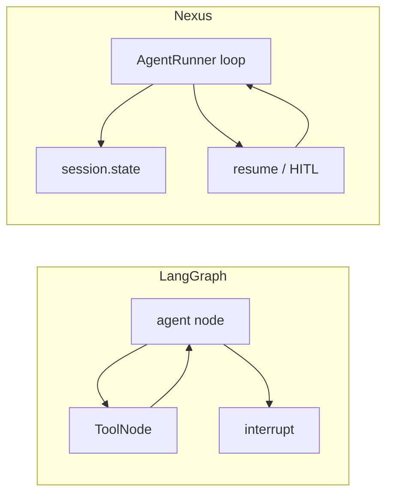
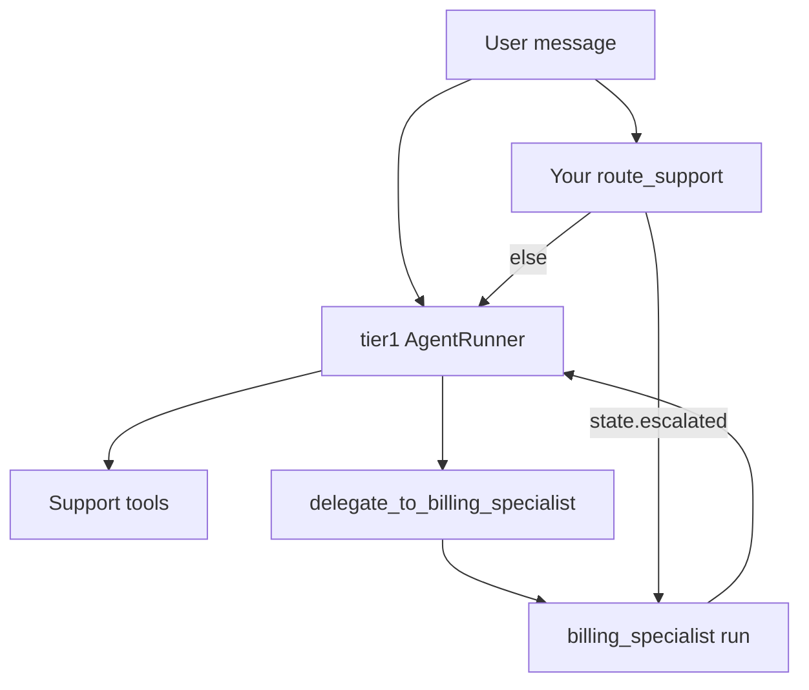

# Porting from LangGraph

**Who this is for:** Developers who built a stateful agent with [LangGraph](https://langchain-ai.github.io/langgraph/) and want the same behaviour on Nexus without adding LangGraph as a dependency.

## Key terms

- **StateGraph** — LangGraph object that wires nodes and edges; state is a typed dict (often `messages` plus custom fields).
- **Checkpointer** — LangGraph store (for example `MemorySaver`, `SqliteSaver`) that saves graph state per `thread_id`.
- **Conditional edge** — Route to the next node based on state or tool output.
- **Interrupt** — Pause the graph for human approval, then resume.
- **Checkpoint state** — In Nexus, `RunContext.state` synced to `AgentSession.state` when storage persists.
- **Chat thread** — Nexus `session_id` (same role as LangGraph `thread_id`).

## Why this guide exists

Nexus targets production SaaS: tenants, storage adapters, voice, and multi-agent teams. Stateful agents were always possible, but the docs showed pieces (memory, pause/resume, teams) rather than one end-to-end story. This page ports **one complex LangGraph app** to Nexus so you can map concepts directly.

LangGraph is **not installed** in this repository. Section 1 is illustrative pseudocode. Section 2 and 3 are runnable Nexus (mock or real LLM).

## The scenario

A **tier-1 support agent** that:

1. Keeps structured state: `customer_id`, `plan_tier`, `escalated`.
2. Runs a ReAct loop (LLM → tools → LLM).
3. Routes to escalation when a tool signals it.
4. Pauses for **human approval** before issuing a refund.
5. Can hand off to a **billing specialist** (sub-agent).
6. Persists state across messages on the same thread.



---

## Section 1: LangGraph version (illustrative only)

> Not runnable here — `langgraph` is not a dependency of Nexus.

```python
# Illustrative LangGraph — do not run in this repo.
from typing import Annotated, TypedDict
from langgraph.graph import StateGraph, END
from langgraph.checkpoint.sqlite import SqliteSaver

class SupportState(TypedDict):
    messages: Annotated[list, add_messages]
    customer_id: str
    plan_tier: str
    escalated: bool

def agent_node(state: SupportState):
    ...  # call LLM with tools

def should_escalate(state: SupportState) -> str:
    if state["escalated"]:
        return "human"
    return "agent"

builder = StateGraph(SupportState)
builder.add_node("agent", agent_node)
builder.add_node("tools", tool_node)
builder.add_conditional_edges("agent", should_escalate, {"agent": "tools", "human": "human"})
builder.add_edge("tools", "agent")
checkpointer = SqliteSaver.from_conn_string("support.db")
graph = builder.compile(checkpointer=checkpointer, interrupt_before=["human"])

config = {"configurable": {"thread_id": "cust-42"}}
graph.invoke({"messages": [("user", "Refund my last charge")]}, config)
# Human approves → graph.invoke(None, config) continues
```

---

## Section 2: Nexus port (Python API)

Same scenario with Nexus primitives: checkpoint `state`, storage adapter, client-tool pause, optional supervisor team.

### Tools

```python
from nexus.tools.context import RunContext
from nexus.tools.decorators import tool

@tool(name="fetch_account")
def fetch_account(ctx: RunContext, customer_id: str) -> str:
    ctx.set_state("customer_id", customer_id)
    tier = ctx.get("plan_tier") or "standard"
    ctx.set_state("plan_tier", tier)
    return f"Account {customer_id} plan={tier}"

@tool(name="issue_refund", execution="client", description="Request human approval in the UI")
def issue_refund(ctx: RunContext, amount: float) -> str:
    return ""  # filled by client via resume()

@tool(name="mark_escalate")
def mark_escalate(ctx: RunContext, reason: str) -> str:
    ctx.set_state("escalated", True)
    ctx.set_state("escalate_reason", reason)
    return "STATUS: escalate"
```

Use `ctx.set_state` for fields that must exist on the **next** HTTP request. Use `ctx.set` / `ctx.get` on `metadata` only for per-request data (see [run-context.md](../reference/run-context.md)).

### Agent and storage

```python
import asyncio
from nexus import AgentConfig, AgentRunner, LLMProviderConfig, RunContext
from nexus.config.agent import TurnConfig
from nexus.config.storage import SessionStorageConfig
from nexus.runner.hooks import TurnContext, TurnDecision
from nexus.tools.registry import ToolRegistry

async def on_turn_end(ctx: TurnContext) -> TurnDecision | None:
    if ctx.state.get("escalated") and not ctx.state.get("refund_approved"):
        return TurnDecision(action="inject", message="Summarize case for human reviewer.")
    return None

def build_runner(tenant_id: str, plan: str) -> AgentRunner:
    registry = ToolRegistry()
    registry.add_toolset("support", [fetch_account, issue_refund, mark_escalate])

    config = AgentConfig(
        name="tier1_support",
        llm=LLMProviderConfig(provider="openai", model="gpt-4o", api_key="sk-..."),
        turns=TurnConfig(max_turns=8, human_in_loop_after_turns=None),
        toolset="support",
    )
    storage = SessionStorageConfig(adapter="sqlite", adapter_config={"data_root": "./data"})
    run_ctx = RunContext(
        tenant_id=tenant_id,
        user_id="user-1",
        session_id="support-thread-1",
        metadata={"plan_tier": plan},
    )
    return AgentRunner(
        config=config,
        tool_registry=registry,
        storage_config=storage,
        run_context=run_ctx,
        on_turn_end=on_turn_end,
    )

async def main():
    runner = build_runner("acme", "pro")
    result = await runner.run(
        "Refund my last charge",
        initial_context={"customer_id": "cust-42"},
    )
    if result.status == "paused":
        # Client tool or human_in_loop pending — UI collects approval
        result = await runner.resume(
            result.session_id,
            results=[{"tc_id": "TC2", "content": "Approved: refund $50"}],
        )
    print(result.final_response)
    print(result.state)  # escalated, customer_id, ...

asyncio.run(main())
```

### Streaming (typical SaaS path)

```python
async for event in runner.run_stream(
    "Where is my invoice?",
    initial_context={"customer_id": "cust-42"},
):
    if event.event_type == "paused":
        ...  # show approval UI
    if event.event_type == "final_response":
        ...  # event.data includes state
```

### Concept mapping

| LangGraph | Nexus |
|-----------|--------|
| `StateGraph` + typed state | Chat history (automatic) + `ctx.state` |
| `ToolNode` loop | Built-in ReAct loop in `AgentRunner` |
| `add_conditional_edges` | Tool return strings + persona, `on_turn_end`, or `run_stream` supervision |
| `interrupt()` | `@tool(execution="client")` + `resume()`, or `human_in_loop_after_turns` |
| `SqliteSaver` / checkpointer | `SessionStorageConfig(adapter="sqlite")` + `session.state` |
| `thread_id` | `RunContext.session_id` |
| Subgraph / specialist | `pattern: supervisor` + `delegate_to_*` |
| User facts across threads | `cross_session_memory_store` + `user_id` ([memory.md](../reference/memory.md)) |

### Redirecting to another agent (three patterns)

Section 2 above is **one** `AgentRunner` (tier-1 only). It does **not** switch to the billing specialist — that is a different mechanism. Scenario item 5 (“hand off to billing”) maps to one of these:

| Approach | Who decides | When to use |
|----------|-------------|-------------|
| **Supervisor + `delegate_to_*`** | The lead LLM calls a delegate tool | Dynamic handoff (“this looks like billing”) |
| **App/router in Python** | Your code reads `result.state` or `on_turn_end` | Fixed rules (“if `escalated`, run billing runner”) |
| **Pipeline** | Fixed member order in YAML | Always tier-1 → billing, not conditional |

#### 1. LLM-driven redirect (supervisor team)

With `pattern: supervisor`, Nexus picks a **lead** agent (first member named `supervisor`, else **first member in `members`**). For each other member it registers a tool on the shared registry:

- `supervisor.delegate_to_billing_specialist(task_input: str)` → runs that member’s `AgentRunner` and returns its `final_response` to the lead.

The lead must **see** those tools. If you set `toolset: support` on the lead, delegate tools (plugin `supervisor`) may be hidden. Common fixes:

- Leave `toolset` unset on the lead so it sees all registered tools, **or**
- Teach the lead in the system prompt: “For invoice disputes, call `delegate_to_billing_specialist` with a short task summary.”

Example prompt line in `tier1_system`:

```text
When the user needs deep billing lookup (invoices, charges, tax lines), call
delegate_to_billing_specialist with the customer id and question. Otherwise use support tools yourself.
```

That is **logic via the model + tools**, not a separate routing engine — same idea as LangGraph conditional edges where the router is the LLM reading state/tool results.

#### 2. Deterministic redirect (your application)

When routing must not depend on the model, branch **outside** the loop:

```python
async def route_support(user_message: str, session_id: str):
    manager = tier1_runner.session_manager
    sess = await manager.load_session(session_id, scope=tier1_runner.run_context.to_scope())
    state = (sess.state if sess else {}) or {}

    if state.get("route") == "billing" or state.get("escalated"):
        return await billing_runner.run(user_message, session_id=f"{session_id}_billing")

    result = await tier1_runner.run(user_message, session_id=session_id)
    if result.state.get("needs_billing"):
        return await billing_runner.run(
            user_message,
            session_id=f"{session_id}_billing",
            initial_context=dict(result.state),
        )
    return result
```

`on_turn_end` can set flags (`ctx.state["needs_billing"] = True`) or return `TurnDecision(action="stop")` so the app runs a **different** runner on the next line — it does not invoke another agent by itself.

#### 3. Logic-based **tool** choice (still one agent)

Same tier-1 agent, different **tools** exposed per tenant/plan:

```python
def build_registry(plan: str) -> ToolRegistry:
    registry = ToolRegistry()
    registry.add_toolset("support", [fetch_account, mark_escalate])
    if plan == "pro":
        registry.add_toolset("support", [issue_refund])  # refund only on pro
    return registry
```

Or per request: `runner.grant_toolset("billing")` before `run()`. The LLM still chooses which tool to call; you control the **menu**, not the graph edge.

#### 4. Fixed handoff (pipeline, not conditional)

```yaml
groups:
  billing_flow:
    pattern: pipeline
    members: [tier1, billing_specialist]
```

Analyst always runs after tier-1 with tier-1’s final text as input — no “if billing then” branch. See [multi-agent.md](../reference/multi-agent.md).



---

## Section 3: YAML manifest (supervisor + billing)

Declarative team: a **lead** tier-1 agent delegates to `billing_specialist` via auto-generated `delegate_to_billing_specialist` tools (supervisor pattern). Put the lead **first** in `members`, or name an agent `supervisor` like [research_team.yaml](../../examples/orchestration/research_team.yaml).

Tools are registered in Python on a `ToolRegistry` passed to `OrchestrationRuntime.from_manifest()`. The lead agent should usually **not** use a narrow `toolset` unless that toolset includes delegate tools — see [Redirecting to another agent](#redirecting-to-another-agent-three-patterns) above.

```yaml
version: "1"
prompts_module: ./support_team_prompts.py
root: support_team

defaults:
  llm: &llm
    provider: openai
    model: ${ENV:OPENAI_MODEL|gpt-4o}
    api_key: ${ENV:OPENAI_API_KEY|mock-key}

storage:
  adapter: sqlite
  adapter_config:
    data_root: ${ENV:NEXUS_DATA_ROOT|./data}

agents:
  tier1:
    llm: *llm
    # No toolset — lead sees support tools + delegate_to_billing_specialist
    tool_plugins: []
    persona:
      role: Tier-1 support lead
      goal: Resolve or delegate billing issues
      prompt: tier1_system

  billing_specialist:
    llm: *llm
    toolset: billing
    persona:
      role: Billing specialist
      goal: Deep billing lookups
      prompt: billing_system

groups:
  support_team:
    pattern: supervisor
    members: [tier1, billing_specialist]
```

Run:

```python
from nexus import OrchestrationManifest, OrchestrationRuntime, RunContext

manifest = OrchestrationManifest.load("support_team.yaml")
runtime = OrchestrationRuntime.from_manifest(
    manifest,
    run_context=RunContext(tenant_id="acme", user_id="u-1", session_id="chat-1"),
    tool_registry=build_support_registry(),
)
result = await runtime.run("I was double charged")
# Internally: tier1 may call supervisor.delegate_to_billing_specialist("customer X double charge...")
```

Member chat ids are `{session_id}_{member_name}`; checkpoint `state` is **per member session**. Copy shared fields with `initial_context` or `ctx.set_state` in tools on a shared `RunContext` for the request if both agents need the same `customer_id`.

---

## Section 4: Porting checklist

1. **List state fields** — Put durable fields in `ctx.state`; keep voice/IVR transients in `metadata` only.
2. **Map nodes** — One ReAct agent per role, or a supervisor group for specialists.
3. **Map tool loop** — Delete custom ToolNode; use `AgentRunner.run`.
4. **Map conditional edges** — Prefer explicit tool status strings; use `on_turn_end` when routing must be deterministic in Python.
5. **Map interrupt** — Client tools + `resume()`, or `turns.human_in_loop_after_turns`, or a new user message on the same `session_id`.
6. **Map checkpointer** — Pick a storage adapter; pass stable `session_id` per chat thread.
7. **Map subgraphs** — `groups.pattern: supervisor` with `delegate_to_{member}` tools.
8. **Tenancy** — Set `RunContext.tenant_id`, `user_id`, and optional `PersistenceResolver` ([saas-example.md](saas-example.md)).

---

## Section 5: What you gain / what to watch

**Gain:** Multi-tenant identity, per-plan config factories, the same tools on text and voice pipelines, and production storage without wrapping LangGraph.

**Watch:**

- YAML manifests do not declare conditional edges; use Python (`on_turn_end`) or LLM routing.
- `NexusEventEmitter` sinks observe only — they cannot pause the loop (unlike `on_turn_end`).
- `stop_on_result_type` and `stop_sequences` are not enforced in the runner yet ([runtime-control.md](runtime-control.md)).

---

## Next steps

- [Runtime control](runtime-control.md) — layers of control beyond the default loop
- [Pipelines](pipelines.md) — text, voice, teams
- [Run context](../reference/run-context.md) — `state` vs `metadata`
- [Agent runner](../reference/agent-runner.md) — `on_turn_end`, `resume()`, `run_stream(initial_context=)`
- [Multi-agent](../reference/multi-agent.md) — supervisor handoff
- [SaaS example](saas-example.md) — FastAPI wiring
