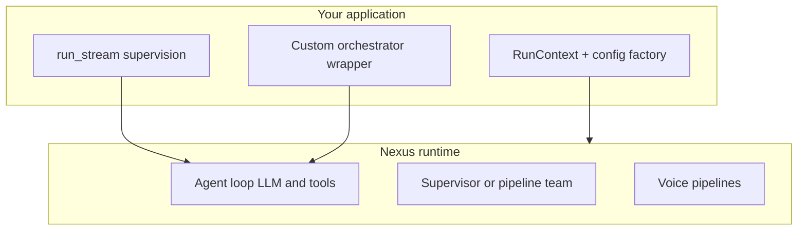

# Runtime control: take charge without a state graph

**Who this is for:** Developers who need deterministic control when a tool returns a specific value, tenant state changes, or they want LangGraph-style branching without building an explicit graph in Nexus.

## Key terms

- **Run context** — Per-request identity: tenant, user, chat thread, and a `metadata` bag your tools can read and write.
- **Supervision** — Your application code watches the agent loop (via streaming or events) and decides what to do next.
- **External human-in-the-loop (HITL)** — Stop the run, show a UI, then resume on the same chat thread with a new user message.
- **Pattern** — Multi-agent coordination style (`supervisor`, `pipeline`, `parallel`) — see [pipelines.md](pipelines.md).

## What Nexus does and does not do

Nexus is built for **SaaS-native dynamic assembly**: different tenants get different configs, tools, and storage **per request**. Inside a run, the default loop is **LLM-driven** (the model picks the next tool or reply based on context).

Nexus does **not** ship LangGraph-style features today:

- No conditional edges in YAML (`if tool X returns Y → go to agent Z`)
- No automatic human approval gate on tool calls (`requires_approval` is metadata only today)

Nexus **does** support mid-loop pause for **client tools** and elicitations via `AgentRunner.resume()` (see [Pause and resume](#pause-and-resume-client-tools)).

You **can** take control. The patterns below are all supported today.



For which pipeline to run, see [pipelines.md](pipelines.md).

---

## Layer 1: Per-request control (before the run starts)

Use this when behavior depends on **who** is calling, not on mid-run tool output.

### RunContext

Build one `RunContext` per HTTP request or job:

```python
from nexus import RunContext

ctx = RunContext(
    tenant_id="acme",
    user_id="user-42",
    session_id="chat-1",
    metadata={"plan_tier": "pro", "locale": "en-IN"},
)
```

Tools with a `RunContext` parameter receive it automatically (stripped from the LLM schema). See [run-context.md](../reference/run-context.md).

### Per-tenant config factory

Different plans or tenants get different `AgentConfig` — tools, prompts, `max_turns`:

```python
def build_runner(tenant_id: str, plan: str) -> AgentRunner:
    config = build_config_for_plan(plan)
    registry = registry_for_plan(plan)
    ctx = RunContext(tenant_id=tenant_id, metadata={"plan_tier": plan})
    return AgentRunner(config=config, tool_registry=registry, run_context=ctx)
```

**Worked example:** [examples/nexus_saas_api.py](../../examples/nexus_saas_api.py), [saas-example.md](saas-example.md).

### Per-tenant storage

`PersistenceResolver` picks where chat history is saved per tenant. See [persistence-resolver.md](persistence-resolver.md).

### Dynamic prompts

Jinja prompt templates can read `tenant_id`, `metadata`, and memory at render time. See [prompts-jinja.md](prompts-jinja.md).

**Important:** `OrchestrationRuntime` is built once at construction. To change config mid-run, build a **new** runtime for the next request.

---

## Layer 2: State that survives across turns

Use this when tools need shared state within one chat thread.

### initial_context

Merge key/value pairs into `session.metadata` once at run start:

```python
result = await runner.run(
    "Start onboarding",
    session_id="chat-1",
    initial_context={"step": "welcome", "account_id": "acc-99"},
)
```

### RunContext.metadata (read and write)

Tools can mutate the metadata bag for later tools in the same run:

```python
from nexus.tools.context import RunContext
from nexus.tools.decorators import tool

@tool(name="reserve_slot")
def reserve_slot(ctx: RunContext, slot_id: str) -> str:
    ctx.set("reserved_slot", slot_id)
    return f"Reserved {slot_id}"

@tool(name="confirm_booking")
def confirm_booking(ctx: RunContext) -> str:
    slot = ctx.get("reserved_slot")
    if not slot:
        return "ERROR: no slot reserved"
    return f"Confirmed {slot}"
```

The LLM still chooses when to call each tool, but **your Python code** owns the state.

### RCS context updates

When RCS is enabled, the LLM can pass `_context_updates` on tool calls to compress prior tool results. See [agent-config.md § RCS](../reference/agent-config.md).

---

## Layer 3: Branching after a tool returns

### Option A — Let the LLM decide (default)

Tool results are appended to chat context. The LLM reads them on the next turn and picks the next tool or final reply. Encode clear return strings:

```python
@tool(name="check_balance")
def check_balance(ctx: RunContext) -> str:
    balance = fetch_balance(ctx.tenant_id)
    if balance < 0:
        return "STATUS: escalate reason=negative_balance"
    return f"STATUS: ok balance={balance}"
```

Teach the persona to act on `STATUS: escalate` in the system prompt.

### Option B — Multi-agent routing

| Pattern | Control style | Doc |
|---------|---------------|-----|
| `supervisor` | LLM picks `delegate_to_{member}` | [multi-agent.md](../reference/multi-agent.md) |
| `pipeline` | Fixed member order; deterministic handoff | [pipelines.md § Pipeline](pipelines.md) |
| `parallel` | All members on same input; merge outputs | [pipelines.md § Parallel](pipelines.md) |

### Option C — Supervise with run_stream (your app branches)

Watch `tool_result` events and stop or reroute in application code:

```python
escalated = False
async for event in runner.run_stream(user_msg, stream=True):
    if event.event_type == "tool_result" and "escalate" in (event.content or ""):
        escalated = True
        break
    if event.event_type == "final_response":
        result = event.data

if escalated:
    await notify_human_queue(session_id)
    # optionally start a different runner or return early
```

`AgentStreamEvent` types: `content`, `tool_call`, `tool_result`, `client_tool_call`, `elicitation`, `paused`, `final_response`, `error`, `event`.

See [streaming.md](../reference/streaming.md) and [events.md](../reference/events.md).

### Option D — Wrap the runner (full Python control)

Run one or more turns yourself, inspect `AgentRunResult`, branch in Python:

```python
result = await runner.run("Look up order 12345")
if "not_found" in result.final_response:
    result = await runner.run(
        "Order not found. Ask the user for their email.",
        session_id=result.session_id,
    )
```

Stronger control than LLM routing; more code on your side.

### Option E — Channels: fresh executor per message

`ChannelRouter` accepts `executor_factory: Callable[[RunContext], Executor]`. Each inbound message can build a new runner from current tenant state:

```python
router = ChannelRouter(
    adapter=adapter,
    executor_factory=lambda ctx: build_runner_for_tenant(ctx.tenant_id),
)
```

See [realtime-agents.md § Channels](../reference/realtime-agents.md).

---

## Layer 4: Observability hooks (react, not pause)

Pass `event_emitter=` to `AgentRunner` or `OrchestrationRuntime` (single-agent root only for orchestration runtime).

```python
from nexus.events.emitter import NexusEventEmitter, CustomCallbackSink
from nexus.events.models import NexusEventType

async def on_event(event):
    if event.event_type == NexusEventType.TOOL_CALL_COMPLETED:
        print("tool done:", event.data)

emitter = NexusEventEmitter()
emitter.add_sink(CustomCallbackSink(on_event))
runner = AgentRunner(config, registry, event_emitter=emitter)
```

Event types include `tool_call.started`, `tool_call.completed`, `turn.completed`, `agent.completed`, and more. Full list: [events.md](../reference/events.md).

**Note:** Callbacks observe the run; they do not pause the loop. Combine with `run_stream` if you need to stop early.

---

## Layer 5: Pause and resume (client tools)

<a id="pause-and-resume-client-tools"></a>

Use this when the **browser or mobile app** must run a tool, or when the model asks the user a structured question.

### Mark a tool as client-side

```python
@tool(name="pick_file", execution="client", description="Ask the user to pick a file")
def pick_file(prompt: str) -> str:
    return ""
```

Tools whose name ends with `request_user_input` are treated as **elicitations** (same pause path, `event_type="elicitation"`).

### Stream events

| Event | Meaning |
|-------|---------|
| `client_tool_call` | Client tool requested; `data` has `tc_id`, `call_id`, `tool_name`, `tool_args` |
| `elicitation` | User-input tool requested |
| `paused` | Loop stopped; `data.pending_interactions` lists what to fulfill |

Blocking `run()` returns `AgentRunResult` with `status="paused"` and the same `pending_interactions`.

### Resume API

```python
result = await runner.resume(
    session_id,
    results=[
        {"tc_id": "TC1", "content": "user picked report.pdf"},
        # or match by provider id:
        # {"call_id": "call_abc", "content": "..."},
    ],
)
```

| Name | Required? | Default | What it does |
|------|-----------|---------|--------------|
| `session_id` | Yes | — | Chat thread that was paused |
| `results` | Yes | — | List of `{"tc_id"\|"call_id": ..., "content": "..."}` |
| `stream` | No | `False` | Passed through to the continued `run()` |

The runner fills empty tool responses, clears `pending_interactions`, saves (if `should_persist`), and continues the loop.

See [tools.md](../reference/tools.md) and [streaming.md](../reference/streaming.md).

---

## Layer 6: External human-in-the-loop (HITL)

Built-in pause-after-N-turns is **not enforced** yet (`human_in_loop_after_turns` in config). For operator approval that is **not** a client tool:

1. Run until `final_response` or your supervision breaks the stream.
2. Chat history is already saved (if storage is configured and `should_persist`).
3. Show UI to the human operator.
4. Resume with a new `user_message` on the **same** `session_id`:

```python
# Operator approves or edits:
result = await runner.run(
    "Approved: refund $50 to customer",
    session_id=existing_session_id,
)
```

Prefer Layer 5 (`execution="client"` + `resume()`) when the UI itself must execute the tool.

---

## LangGraph mapping (mental model)

| LangGraph idea | Nexus equivalent today |
|----------------|------------------------|
| Graph state | `RunContext.metadata` + `session.metadata` + turn history |
| Conditional edge after node | LLM routing, or **your** `run_stream` / wrapper |
| Human interrupt node | Client tools + `resume()`, or external HITL: stop, persist, new message |
| Fixed sequence | `pattern: pipeline` |
| Dynamic delegation | `pattern: supervisor` + `delegate_to_*` |
| Observe every step | `run_stream()` + `NexusEventEmitter` |

---

## Config fields that look like control but are not wired yet

| Field | Documented in | Status |
|-------|---------------|--------|
| `human_in_loop_after_turns` | [agent-config.md](../reference/agent-config.md) | Config only — no pause in runner |
| `stop_on_result_type` | [agent-config.md](../reference/agent-config.md) | Not checked in runner loop |
| `stop_sequences` | [agent-config.md](../reference/agent-config.md) | Not checked in runner loop |
| `requires_approval` on `@tool` | [tools.md](../reference/tools.md) | Metadata only — no gate |

Design direction for these features is in [NEXUS_AGENT_PRD.md](../../NEXUS_AGENT_PRD.md).

---

## Scenario cheat sheet

| Scenario | Recommended approach |
|----------|---------------------|
| Gate tools by SaaS plan | Config factory + `tool_plugins` allow-list |
| Toggle capability packs per chat | `toolsets` + `enabled_toolsets` on `run()` |
| Share data between tools in one run | `ctx.set()` / `ctx.get()` on `RunContext` |
| Browser must pick a file / show a form | `@tool(execution="client")` + `resume()` |
| Escalate to human on tool signal | `run_stream` + break on `tool_result` |
| Fixed research → write → review | `pattern: pipeline` in manifest |
| Dynamic specialist routing | `pattern: supervisor` |
| Deterministic Python workflow | Wrap `AgentRunner` or pipeline pattern |
| Cron job must not save chat | `RunContext(is_cron=True)` |
| Voice: user interrupts agent | `duplex: full` cascaded pipeline |
| Phone DTMF menus | `duplex: half` + `ivr_menu` plugin |

## Next steps

- [Pipelines guide](pipelines.md) — choose STT→LLM→TTS, S2S, teams, channels
- [Architecture](../architecture.md) — config vs run-time split
- [Run context](../reference/run-context.md) — field reference
- [Streaming](../reference/streaming.md) — `run_stream` API
- [Events](../reference/events.md) — `NexusEventEmitter` and event types
