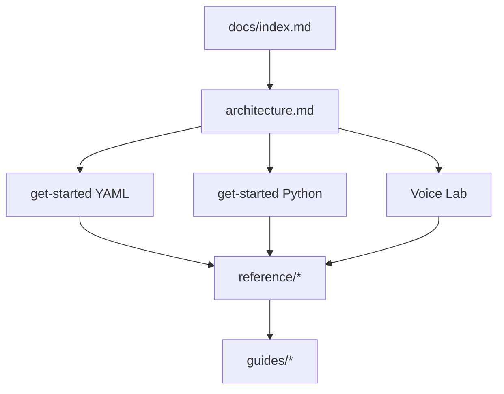

# Nexus documentation

**Who this is for:** Developers building chat agents or multi-agent teams with Nexus, including SaaS (software as a service) apps with many customers.

## Key terms

- **Agent** — A program that talks to a large language model (LLM) and can call **tools** (small programs the model can trigger).
- **Config** — Settings that describe what an agent is (model, personality, limits).
- **Run context** — Settings that describe who is calling and which chat thread this is.
- **Manifest** — A YAML file that describes one or more agents and how they work together.
- **Orchestration** — Loading a manifest and running the described agents.
- **Runner** — The object that executes one agent loop (`run()` or `run_stream()`).
- **Storage** — Where chat history is saved (memory, file, SQLite, PostgreSQL, Redis).
- **Cascaded voice** — A voice pipeline: VAD → STT → LLM → TTS as separate stages.
- **Media server** — A gRPC process that hosts an STT, TTS, VAD, or LID engine.
- **Voice Lab** — Browser UI for full-duplex voice testing with real media servers.

## What is Nexus?

Nexus is an agent framework for building production apps. You describe agents in config. You wire who is calling and where data lives at run time. Then you call `run()`.

There is no global settings object. Each agent can use a different LLM (large language model) provider. Storage and tenant (customer) identity are explicit.

## Reading order

1. [Architecture](architecture.md) — What goes where (config vs run time).
2. [Getting started (YAML)](getting-started.md) — Fastest path: manifest + prompts + run.
3. [Getting started (Python)](getting-started-python.md) — Build everything in code.
4. [Voice Lab](guides/voice-lab.md) — Browser voice testing with gRPC media servers.
5. [Reference](reference/manifest-schema.md) — Every parameter and default.
6. [Guides](guides/pipelines.md) — Pipelines, runtime control, SaaS, and prompts.



## Quick links

| Topic | Doc |
|-------|-----|
| YAML manifest fields | [reference/manifest-schema.md](reference/manifest-schema.md) |
| Agent config | [reference/agent-config.md](reference/agent-config.md) |
| Runner and runtime | [reference/agent-runner.md](reference/agent-runner.md) |
| Who is calling | [reference/run-context.md](reference/run-context.md) |
| Save chat history | [reference/storage.md](reference/storage.md) |
| Custom storage adapter | [guides/custom-storage-adapter.md](guides/custom-storage-adapter.md) |
| Custom memory store | [guides/custom-memory-store.md](guides/custom-memory-store.md) |
| Tools | [reference/tools.md](reference/tools.md) |
| Memory | [reference/memory.md](reference/memory.md) |
| Context summary | [reference/context-summary.md](reference/context-summary.md) |
| Pipelines (text, voice, teams) | [guides/pipelines.md](guides/pipelines.md) |
| Voice Lab (browser testing) | [guides/voice-lab.md](guides/voice-lab.md) |
| gRPC media servers | [guides/model-servers.md](guides/model-servers.md) |
| Media server config reference | [reference/server.md](reference/server.md) |
| Runtime control | [guides/runtime-control.md](guides/runtime-control.md) |
| Porting from LangGraph | [guides/porting-from-langgraph.md](guides/porting-from-langgraph.md) |
| Multi-agent teams | [reference/multi-agent.md](reference/multi-agent.md) |
| Voice, vision, channels | [reference/realtime-agents.md](reference/realtime-agents.md) |
| Streaming | [reference/streaming.md](reference/streaming.md) |
| Events and observability | [reference/events.md](reference/events.md) |
| Skills | [reference/skills.md](reference/skills.md) |
| Skills storage (learned) | [guides/skills-storage.md](guides/skills-storage.md) |
| Environment variables | [reference/environment.md](reference/environment.md) |
| SaaS example | [guides/saas-example.md](guides/saas-example.md) |
| Prompt templates | [guides/prompts-jinja.md](guides/prompts-jinja.md) |
| Example index | [examples.md](examples.md) |
| Writing style | [style-guide.md](style-guide.md) |
| Full design spec | [NEXUS_AGENT_PRD.md](../NEXUS_AGENT_PRD.md) |

## Install

From PyPI:

```bash
pip install nexus-enterprise-agent
```

With extras (see [storage](reference/storage.md) and [environment](reference/environment.md)):

```bash
pip install "nexus-enterprise-agent[sqlite,litellm,fastapi,realtime,grpc]"
```

For voice with gRPC media servers:

```bash
pip install "nexus-enterprise-agent[realtime,fastapi,grpc,server,litellm]"
```

For local development:

```bash
uv sync --extra dev --extra sqlite --extra file
```

For Voice Lab:

```bash
uv sync --extra server --extra grpc --extra fastapi --extra realtime --extra litellm
```

Run tests:

```bash
uv run pytest
```
