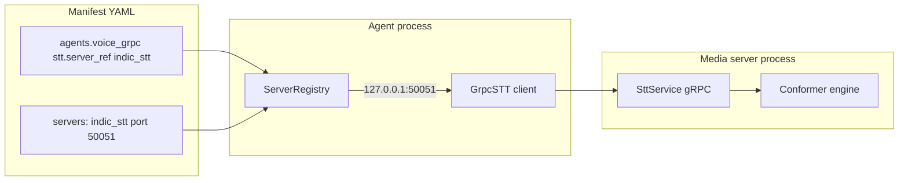

# Media server and `server_ref` reference

**Who this is for:** Developers running STT, TTS, VAD, or LID as separate gRPC processes and wiring voice agents to them.

## Key terms

- **Media server** — A long-running gRPC process that loads one model (speech-to-text, text-to-speech, etc.) and listens on a `host:port`.
- **`servers:` block** — YAML map that **defines** each media server: engine, port, device, and options.
- **`server_ref`** — A **label** on the agent side (`stt.server_ref: indic_stt`) that points at one entry in `servers:`.
- **Registry** — Runtime lookup table: `server_ref` → `host:port` so adapters know where to connect.
- **Adapter** — Client code in the agent process (`GrpcSTT`, `GrpcTTS`, `GrpcLID`, …) that speaks gRPC to a media server.
- **LID** — Language identification: detects which language the user spoke before transcription.

## Why `server_ref` exists

Voice agents need four separate capabilities (STT, TTS, VAD, LID). Each can run on its own GPU box, scale independently, or be swapped without changing agent code.

Hard-coding `127.0.0.1:50051` in every agent is brittle. Instead:

1. You **define** servers once under `servers:` with a name you choose (`indic_stt`, `whisper_lid`, …).
2. Each agent **references** that name via `server_ref`.
3. At runtime the **registry** resolves `indic_stt` → `127.0.0.1:50051` and the gRPC client connects.



**Benefits:**

| Benefit | Example |
|---------|---------|
| Swap engines | Point `tts.server_ref` from `indic_tts` to `en_tts` |
| Reuse one server | Many agents share `server_ref: indic_stt` |
| Remote hosts | Set `host: 10.0.1.50` on the server entry |
| Skip registry | Set `base_url: 10.0.1.50:50051` on the adapter block |
| Multi-tenant pools | `ServerRegistry.register_tenant_pool()` maps tenants to dedicated GPUs |

---

## Two YAML files in Voice Lab (important)

Voice Lab uses **two** config files. They must use the **same server names and ports**.

| File | Role | Used by |
|------|------|---------|
| [`examples/orchestration/voice_grpc.yaml`](../../examples/orchestration/voice_grpc.yaml) → `servers:` | **Connection map** — registry resolves `server_ref` → `host:port` | Voice Lab app, `RealtimeRuntime` |
| [`examples/servers.yaml`](../../examples/servers.yaml) | **Process launcher** — starts gRPC listener processes | `run_voice_lab.sh`, `nexus.server up` |

```bash
# Terminal 1: starts processes from examples/servers.yaml
uv run python -m nexus.server up -c examples/servers.yaml

# Terminal 2: Voice Lab reads voice_grpc.yaml for agent + registry
uvicorn examples.voice_lab:app --port 8787
```

If `whisper_lid` is on port `50054` in the manifest but `50055` in `servers.yaml`, LID calls will fail or hit the wrong service.

**Single-file option:** Put all `servers:` entries only in the manifest and run:

```bash
uv run python -m nexus.server up -c examples/orchestration/voice_grpc.yaml
```

Set `NEXUS_SERVERS_CONFIG=examples/orchestration/voice_grpc.yaml` in `.env` so `run_voice_lab.sh` uses the same file for both roles.

---

## Default Voice Lab server map

| `server_ref` label | `kind` | Default port | Engine | Agent block |
|--------------------|--------|--------------|--------|-------------|
| `indic_stt` | `stt` | `50051` | `conformer` | `stt.server_ref` |
| `indic_tts` | `tts` | `50052` | `parler` | `tts.server_ref` |
| `silero_vad` | `vad` | `50053` | `silero` | `vad.server_ref` (optional) |
| `whisper_lid` | `lid` | `50054` | `faster_whisper` | `lid.server_ref` |

Labels are **arbitrary** — you can rename `indic_stt` to `my_stt` as long as `stt.server_ref` matches.

---

## `servers:` block — `ModelServerSpec`

Each key under `servers:` is a logical name. The value describes how to run and connect to that process.

| Name | Required? | Default | What it does |
|------|-----------|---------|--------------|
| `kind` | Yes | — | Server type: `stt`, `tts`, `vad`, or `lid` |
| `engine` | Yes | — | Engine plugin: `mock`, `conformer`, `parler`, `silero`, `faster_whisper`, `kokoro`, … |
| `host` | No | `127.0.0.1` | IP or hostname the server binds to and clients connect to |
| `port` | Yes | — | gRPC port (`1`–`65535`) |
| `device` | No | — | Device for model weights: `cpu`, `cuda`, `cuda:0`, … |
| `replicas` | No | `1` | TTS only — number of engine instances for concurrent synthesis |
| `sample_rate` | No | — | Native audio rate (Hz); TTS engines — must match agent `tts.sample_rate` |
| `extra` | No | `{}` | Engine-specific options (see below) |

### Example: full `servers:` block

```yaml
servers:
  indic_stt:
    kind: stt
    engine: ${ENV:STT_ENGINE|conformer}
    host: 127.0.0.1
    port: ${ENV:STT_PORT|50051}
    device: ${ENV:STT_DEVICE|cpu}
    extra:
      model_id: ai4bharat/indic-conformer-600m-multilingual
      decoding: rnnt          # conformer only: rnnt | ctc

  indic_tts:
    kind: tts
    engine: ${ENV:TTS_ENGINE|parler}
    host: 127.0.0.1
    port: ${ENV:TTS_PORT|50052}
    device: ${ENV:TTS_DEVICE|cuda}
    replicas: 2
    sample_rate: 44100        # Parler native rate; match agent tts.sample_rate
    extra:
      model_id: ai4bharat/indic-parler-tts
      dtype: bfloat16

  silero_vad:
    kind: vad
    engine: silero
    port: 50053
    extra:
      threshold: 0.5
      min_silence_ms: 300

  whisper_lid:
    kind: lid
    engine: faster_whisper
    port: 50054
    device: cpu
    extra:
      model_size: small       # faster_whisper model size for LID
```

### `extra` fields by engine

| Engine | `kind` | Common `extra` keys | What they do |
|--------|--------|----------------------|--------------|
| `conformer` | `stt` | `model_id`, `decoding` | Hugging Face model id; `rnnt` or `ctc` decoding |
| `parler` | `tts` | `model_id`, `dtype` | Model id; compute dtype (`bfloat16`, …) |
| `silero` | `vad` | `threshold`, `min_silence_ms` | Speech probability threshold; trailing silence (ms) |
| `faster_whisper` | `lid` | `model_size` | Whisper size for language ID (`tiny`, `small`, `medium`, …) |
| `mock` | any | — | No GPU; returns deterministic test output |

---

## Agent adapter blocks (`stt`, `tts`, `vad`, `lid`)

These live under each voice agent in the manifest. Set `provider: nexus_server` (aliases: `grpc`, `nexus`) to use gRPC media servers.

### Common fields (all gRPC adapters)

| Name | Required? | Default | What it does |
|------|-----------|---------|--------------|
| `provider` | No | varies | `nexus_server` for gRPC; `mock`, `openai`, `deepgram`, `energy`, … for other backends |
| `server_ref` | Yes* | — | Logical name matching a key under `servers:` |
| `base_url` | No | — | Direct `host:port` override; skips registry when set |
| `sample_rate` | No | `16000` | Audio sample rate (Hz) for this stage |
| `extra` | No | `{}` | Adapter-specific options |

\* Required when `provider` is `nexus_server` unless `base_url` is set.

### `stt` — speech-to-text

| Name | Required? | Default | What it does |
|------|-----------|---------|--------------|
| `language` | No | `en` | Default language when LID is off; fallback when LID confidence is low |
| `model` | No | — | Cloud providers only (e.g. Deepgram `nova-3`) |
| `interim_results` | No | `true` | Stream partial transcripts (streaming STT) |
| `api_key` | No | `""` | Cloud provider API key |

```yaml
stt:
  provider: nexus_server
  server_ref: indic_stt
  language: ${ENV:STT_LANGUAGE|hi}
  sample_rate: 16000
```

When `lid` is enabled, STT receives the **detected** language each turn (see LID section).

### `tts` — text-to-speech

| Name | Required? | Default | What it does |
|------|-----------|---------|--------------|
| `voice` | No | — | Voice id or Parler style description string |
| `sample_rate` | No | `24000` | Playback rate sent to browser; must match server native rate |
| `audio_format` | No | `pcm16` | Output encoding |
| `speed` | No | `1.0` | Speaking rate (`>1` faster, `<1` slower). Native on OpenAI TTS; Parler/mock time-stretch PCM |
| `params` | No | `{}` | Engine-specific options passed through as-is (like LLM `default_params`) |
| `extra` | No | `{}` | Deprecated alias of `params` (merged; `params` wins on conflict) |

```yaml
tts:
  provider: nexus_server
  server_ref: indic_tts
  voice: Divya speaks in a clear expressive voice at a moderate pace.
  sample_rate: ${ENV:TTS_SAMPLE_RATE|44100}
  speed: ${ENV:TTS_SPEED|1.0}    # 1.2 = faster, 0.85 = slower
  params: {}                     # engine-specific pass-through
  # params:
  #   description: Divya speaks quickly and clearly.   # Parler style override
```

With LID enabled, language and voice description update per turn from the detected/reply language.
`speed` and `params` travel over gRPC on every synthesize call.

### `vad` — voice activity detection

| Name | Required? | Default | What it does |
|------|-----------|---------|--------------|
| `threshold` | No | `0.02` | How loud counts as speech (0–1 RMS for energy VAD). **Higher** = ignore more noise / harder to barge-in |
| `silence_ms` | No | `700` | Quiet time after speech before the **assistant** takes its turn |
| `min_speech_ms` | No | `200` | Ignore speech blips shorter than this (ms) |
| `barge_in_min_speech_ms` | No | `250` | While TTS is playing, user must keep talking this long (ms) before interrupt (`0` = first frame) |

```yaml
# Built-in energy VAD (no gRPC server) — typical Voice Lab defaults:
vad:
  provider: energy
  threshold: 0.04                 # noise vs speech
  silence_ms: 600                 # end of user turn
  min_speech_ms: 200
  barge_in_min_speech_ms: 250     # interrupt sensitivity
  sample_rate: 16000

# Or override from .env:
#   VAD_THRESHOLD=0.06
#   VAD_SILENCE_MS=800
#   VAD_MIN_SPEECH_MS=200
#   VAD_BARGE_IN_MIN_SPEECH_MS=300

# Remote Silero server:
vad:
  provider: nexus_server
  server_ref: silero_vad
  sample_rate: 16000
```

### `languages` — allowed language stack (optional)

| Field | Required? | Default | What it does |
|-------|-----------|---------|--------------|
| `allowed` | Yes (if block present) | — | ISO codes this agent may use for STT, LLM reply, and TTS |
| `default` | No | `stt.language` or `hi` | Fallback when LID is off or detection is outside `allowed` |

```yaml
languages:
  allowed: [hi, en, gu, ta, te, bn, mr]
  default: hi
```

Startup validation compares `allowed` to each referenced engine's `EngineMeta.languages` (static) and, when servers are running, gRPC `Meta.languages`. Mismatches log warnings so you catch issues like Tamil allowed but Conformer-only STT before a call fails.

Set `NEXUS_VOICE_STRICT_LANG=1` to raise on validation errors instead of only logging them.

### `initial_response` — connect greeting or IVR opening (optional)

Spoken when a voice session connects, before the first user utterance. See [realtime-agents.md](realtime-agents.md#connect-time-initial-response).

| Field | Required? | Default | What it does |
|-------|-----------|---------|--------------|
| `mode` | No | `none` | `none`, `proactive`, or `ivr` |
| `text` | No | — | Fixed greeting (direct TTS when `via_llm: false`) |
| `via_llm` | No | `false` | Run LLM turn with `llm_trigger` before listening |
| `llm_trigger` | No | mode default | Hidden user message for connect LLM turn |
| `ivr_script` | No | — | Ordered lines for IVR without LLM |
| `reply_language` | No | `languages.default` | TTS language (`hi`, `en`, …) |

```yaml
# Hindi greeting
initial_response:
  mode: proactive
  text: "Namaste, main aapki kaise madad kar sakta hoon?"
  via_llm: false
  reply_language: hi

# English greeting
initial_response:
  mode: proactive
  text: "Hello, how can I help you today?"
  via_llm: false
  reply_language: en

# Bilingual IVR script
initial_response:
  mode: ivr
  via_llm: false
  ivr_script:
    - "Welcome. Press 1 for sales, 9 for Hindi."
    - "स्वागत है। बिक्री के लिए 1, हिंदी के लिए 9 दबाएं।"
```

### `lid` — per-turn language detection (optional)

| Name | Required? | Default | What it does |
|------|-----------|---------|--------------|
| `fallback_language` | No | `hi` | Language used when detection confidence is low |
| `sample_rate` | No | `16000` | Input audio rate for LID |

```yaml
lid:
  provider: nexus_server
  server_ref: whisper_lid
  fallback_language: ${ENV:STT_LANGUAGE|hi}
  sample_rate: 16000
```

**When enabled**, each utterance flow is: VAD → **LID** → STT (with detected lang) → LLM → TTS (with reply lang). Users can switch languages mid-conversation; spoken requests like “talk to me in Gujarati” stick for LLM/TTS output. State is **per WebSocket session** (`RunContext`), not global.

When `lid` is **omitted**, STT uses static `stt.language` only (previous behaviour).

---

## Complete agent example

```yaml
servers:
  indic_stt:
    kind: stt
    engine: conformer
    port: 50051
    device: cpu
    extra:
      model_id: ai4bharat/indic-conformer-600m-multilingual
      decoding: rnnt
  indic_tts:
    kind: tts
    engine: parler
    port: 50052
    device: cuda
    sample_rate: 44100
  whisper_lid:
    kind: lid
    engine: faster_whisper
    port: 50054
    device: cpu
    extra:
      model_size: small

agents:
  voice_grpc:
    modality: voice_cascaded
    duplex: full
    stt:
      provider: nexus_server
      server_ref: indic_stt
      language: hi
      sample_rate: 16000
    tts:
      provider: nexus_server
      server_ref: indic_tts
      sample_rate: 44100
    vad:
      provider: energy
      silence_ms: 600
    lid:
      provider: nexus_server
      server_ref: whisper_lid
      fallback_language: hi
    agent:
      llm: ...
      persona: {prompt: voice_system}
```

---

## Recipes

### Swap to English TTS (Kokoro)

```yaml
servers:
  en_tts:
    kind: tts
    engine: kokoro
    port: 50062
    sample_rate: 24000

agents:
  voice_grpc:
    tts:
      provider: nexus_server
      server_ref: en_tts      # was indic_tts
      sample_rate: 24000
```

### Point at a remote GPU box

```yaml
servers:
  indic_stt:
    kind: stt
    engine: conformer
    host: 10.0.1.50           # remote machine
    port: 50051
```

No code changes — registry resolves `indic_stt` → `10.0.1.50:50051`.

### Bypass registry with `base_url`

Useful for one-off debugging:

```yaml
stt:
  provider: nexus_server
  base_url: 127.0.0.1:50051
  language: hi
```

### CPU-only smoke test

```yaml
# In .env or servers.yaml:
# STT_ENGINE=mock  TTS_ENGINE=mock  LID_ENGINE=mock
```

Or omit `lid:` entirely for static-language mode.

---

## gRPC services

Defined in `nexus/server/proto/media.proto`:

| Service | RPC | Direction | Used by |
|---------|-----|-----------|---------|
| **SttService** | `Transcribe`, `StreamTranscribe` | Client → server | `GrpcSTT` |
| **TtsService** | `Synthesize`, `StreamSynthesize` | Client → server | `GrpcTTS` |
| **VadService** | `StreamVad` | Bidirectional | `GrpcVAD` |
| **LidService** | `DetectLanguage` | Unary | `GrpcLID` |
| **HealthService** | `Check`, `Meta` | Unary | Health checks, Voice Lab status |

`AudioFrame.language` is sent on STT requests so the server transcribes in the detected language.

---

## Tenant context on every call

`RunContext` fields (`tenant_id`, `user_id`, `session_id`, `request_id`) are sent as gRPC metadata (`x-tenant-id`, …) on every media call. Optional per-tenant server pools:

```python
registry.register_tenant_pool("acme-corp", {
    "indic_stt": "acme_gpu_stt",
    "indic_tts": "acme_gpu_tts",
})
```

---

## Registry API (Python)

```python
from nexus.server.config import ModelServerSpec, ServersConfig
from nexus.server.registry import ServerRegistry

registry = ServerRegistry(ServersConfig(servers={
    "stt_main": ModelServerSpec(kind="stt", engine="mock", port=50051),
}))
target = registry.target_for("stt_main")   # "127.0.0.1:50051"
await registry.check_health("stt_main")
await registry.require_healthy(["stt_main", "whisper_lid"])
```

---

## CLI

```bash
uv run python -m nexus.server up -c examples/servers.yaml
uv run python -m nexus.server up -c examples/servers.yaml --only whisper_lid
uv run python -m nexus.server health -c examples/servers.yaml
uv run python -m nexus.server status -c examples/servers.yaml
```

---

## Environment variables

See [environment.md](environment.md) for the full list. Common media-server vars:

| Variable | Default | What it does |
|----------|---------|--------------|
| `STT_ENGINE` / `STT_PORT` / `STT_DEVICE` | `conformer` / `50051` / `cpu` | STT server engine and endpoint |
| `TTS_ENGINE` / `TTS_PORT` / `TTS_DEVICE` | `parler` / `50052` / `cuda` | TTS server |
| `VAD_ENGINE` / `VAD_PORT` | `silero` / `50053` | VAD server |
| `LID_ENGINE` / `LID_PORT` / `LID_DEVICE` / `LID_MODEL` | `faster_whisper` / `50054` / `cpu` / `small` | LID server |
| `STT_LANGUAGE` | `hi` | STT default + LID fallback language |
| `NEXUS_SERVERS_CONFIG` | `examples/servers.yaml` | YAML file for `nexus.server up` |
| `NEXUS_VOICE_MANIFEST` | `examples/orchestration/voice_grpc.yaml` | Agent manifest for Voice Lab |

---

## Proto regeneration

After editing `nexus/server/proto/media.proto`:

```bash
uv run python -m grpc_tools.protoc \
  -I nexus/server/proto \
  --python_out=nexus/server/proto \
  --grpc_python_out=nexus/server/proto \
  nexus/server/proto/media.proto
```

Fix the import in `media_pb2_grpc.py`:

```python
from nexus.server.proto import media_pb2 as media__pb2
```

---

## Optional dependencies

| Extra | Installs | Side |
|-------|----------|------|
| `grpc` | grpcio, protobuf | Agent client adapters |
| `server` | torch, transformers, faster-whisper | GPU media server processes |

---

## See also

- [model-servers.md](../guides/model-servers.md) — quick start and transport overview
- [voice-lab.md](../guides/voice-lab.md) — browser testing walkthrough
- [realtime-agents.md](realtime-agents.md) — full voice agent reference
- [manifest-schema.md](manifest-schema.md) — manifest top-level keys
- [`voice_grpc.yaml`](../../examples/orchestration/voice_grpc.yaml) — runnable example with all four server types
